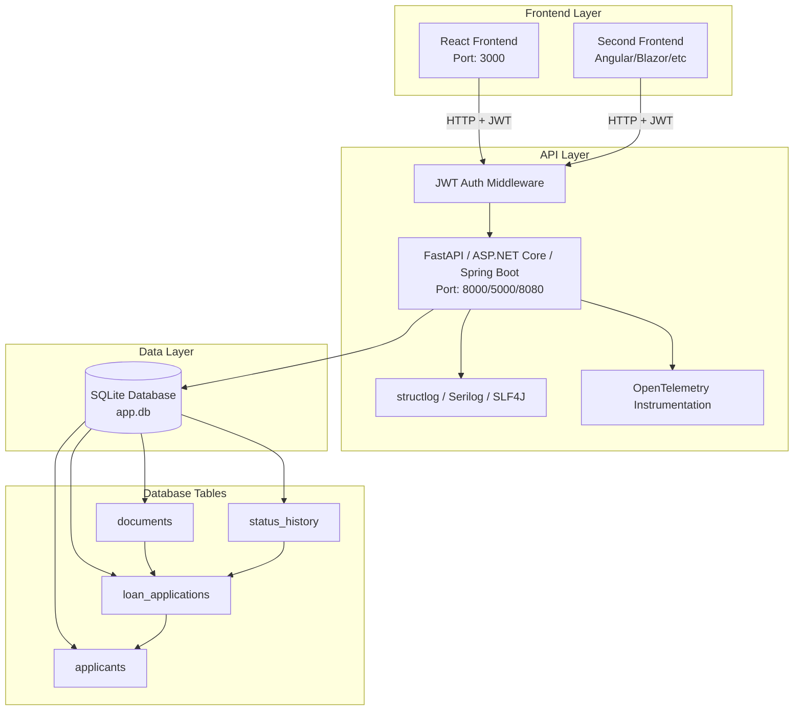

# Phase 1: Full Stack CRUD Application
## POC-01 — Loan Application Management System

**Phase Weight:** 15% | **Duration:** 5 days | **Test Cases:** 20

---

## 1. Phase Overview

### Objectives
By the end of Phase 1, you will have built a complete, production-quality loan application management system with:
- A RESTful API backend with JWT authentication
- A SQLite relational database with 4 entities
- A React frontend (mandatory) + one additional frontend in your chosen framework
- Structured logging via structlog/Serilog/SLF4J
- OpenTelemetry instrumentation
- A comprehensive automated test suite

This application forms the **foundation for all subsequent phases**. The REST API you build here will be:
- Used as RAG knowledge source (Phase 2 user manual)
- Called as tools by a LangChain agent (Phase 3)
- Converted to an MCP server (Phase 4)
- Queried by specialized agents in a multi-agent workflow (Phase 5)

**Do not skip or rush Phase 1** — the quality of your base application directly impacts your success in later phases.

### 5-Day Schedule

| Day | Focus | Activities |
|-----|-------|-----------|
| Day 1 | Setup + Models | Environment setup, data model design, SQLAlchemy/EF/JPA models, database initialization |
| Day 2 | API Backend | Implement all REST endpoints, JWT authentication middleware, structlog setup |
| Day 3 | Testing + Logging | Write unit tests, API integration tests, OTel instrumentation, fix bugs |
| Day 4 | React Frontend | Build React components for all features (use Copilot heavily), connect to API |
| Day 5 | Second Frontend + Review | Build second frontend (Angular/Blazor/Thymeleaf/Streamlit), run all tests, fix failures |

### Learning Outcomes
After Phase 1, you can:
- Design a normalized relational schema for a business domain
- Build a REST API with FastAPI/ASP.NET Core/Spring Boot with full CRUD operations
- Implement JWT authentication with protected routes
- Write automated tests using pytest/xUnit/JUnit 5
- Use GitHub Copilot effectively for full-stack development

---

## 2. Prerequisites

Before starting Phase 1, ensure you have:

- [ ] Python 3.11+ (or .NET 8 SDK / JDK 21) installed and verified
- [ ] Node.js 18+ and npm installed: `node --version` and `npm --version`
- [ ] VS Code installed with extensions: Python/C#/Java, GitHub Copilot, Copilot Chat, SQLite Viewer
- [ ] Git installed and configured
- [ ] Read `TECH_STACK_REFERENCE.md` Sections 1-3 (your stack) and Section 7 (Copilot guide)
- [ ] Google AI Studio API key (needed from Phase 2, but get it now to save time)
- [ ] LangSmith account created (needed from Phase 2)

---

## 3. Concepts to Self-Learn

Spend Day 1 morning reviewing these topics (search terms and resources provided):

| Concept | Search Term / Resource | Estimated Time |
|---------|----------------------|----------------|
| REST API design principles | "REST API best practices 2024" | 30 min |
| JWT authentication flow | "JWT authentication how it works" | 30 min |
| SQLAlchemy ORM basics | "SQLAlchemy 2.0 tutorial" | 45 min |
| FastAPI tutorial | "FastAPI official tutorial" (fastapi.tiangolo.com) | 60 min |
| React hooks (useState, useEffect) | "React hooks tutorial" | 45 min |
| GitHub Copilot vibe coding | Read TECH_STACK_REFERENCE.md Section 7 | 20 min |

**For .Net associates:** Replace SQLAlchemy with "Entity Framework Core tutorial" and FastAPI with "ASP.NET Core Web API tutorial"

**For Java associates:** Replace with "Spring Boot REST API tutorial" and "Spring Data JPA tutorial"

---

## 4. Technology Setup

### Python Stack

```bash
# 1. Create project directory
mkdir poc-01-loan-app && cd poc-01-loan-app

# 2. Create virtual environment
python -m venv venv
venv\Scripts\activate  # Windows

# 3. Create requirements.txt (copy from TECH_STACK_REFERENCE.md Section 1.3)
# Then install:
pip install -r requirements.txt

# 4. Create .env file (copy template from TECH_STACK_REFERENCE.md Section 1.4)
# Update POC_ID=POC-01, PHASE=1

# 5. Create React frontend
npx create-react-app frontend
cd frontend && npm install axios react-router-dom
```

### Project Folder Structure (Python)

```
poc-01-loan-app/
├── backend/
│   ├── app/
│   │   ├── __init__.py
│   │   ├── main.py              ← FastAPI app, middleware, startup
│   │   ├── config.py            ← Settings from .env
│   │   ├── database.py          ← SQLAlchemy engine, session
│   │   ├── models/
│   │   │   ├── __init__.py
│   │   │   ├── applicant.py
│   │   │   ├── application.py
│   │   │   ├── document.py
│   │   │   └── status_history.py
│   │   ├── schemas/
│   │   │   ├── applicant.py     ← Pydantic request/response schemas
│   │   │   └── application.py
│   │   ├── routers/
│   │   │   ├── auth.py
│   │   │   ├── applicants.py
│   │   │   ├── applications.py
│   │   │   └── dashboard.py
│   │   ├── services/
│   │   │   ├── auth_service.py
│   │   │   ├── applicant_service.py
│   │   │   └── application_service.py
│   │   ├── middleware/
│   │   │   └── logging_middleware.py
│   │   └── utils/
│   │       ├── logging_config.py
│   │       └── otel_config.py
│   ├── tests/
│   │   ├── conftest.py
│   │   ├── test_unit/
│   │   └── test_api/
│   ├── .env
│   └── requirements.txt
└── frontend/
    ├── src/
    │   ├── components/
    │   │   ├── ApplicationForm.jsx
    │   │   ├── ApplicationList.jsx
    │   │   ├── ApplicationDetail.jsx
    │   │   └── Dashboard.jsx
    │   ├── pages/
    │   ├── services/
    │   │   └── api.js           ← Axios API client
    │   └── App.jsx
    └── package.json
```

---

## 5. User Stories

### US-01-P1-01: Submit Loan Application
**Role:** Applicant | **Priority:** Must Have | **Story Points:** 5

> As a loan applicant, I want to submit a new loan application with my personal and financial details, so that I can apply for a loan digitally without visiting the branch.

**Acceptance Criteria:**
- **Given** a registered applicant with valid credentials, **When** they POST to `/api/v1/applications` with valid loan_type, amount, tenure, and purpose, **Then** a new application is created with status `submitted`, assigned a unique ID, and a 201 response is returned
- **Given** a POST request with missing required fields (e.g., no loan_type), **When** the API receives the request, **Then** a 422 Unprocessable Entity response is returned with field-level validation errors
- **Given** a POST request without a valid JWT token, **When** the API receives the request, **Then** a 401 Unauthorized response is returned

**Technical Constraints:** loan_type must be one of [personal, home, auto]; amount must be between 10,000 and 10,000,000; tenure must be between 6 and 360 months

**Definition of Done:** Endpoint implemented, unit test for service logic written, API integration test written, endpoint logs entry/exit with structlog

---

### US-01-P1-02: View Application Details
**Role:** Applicant/Loan Officer | **Priority:** Must Have | **Story Points:** 3

> As a loan officer, I want to view the complete details of a loan application including its status history, so that I can make an informed review decision.

**Acceptance Criteria:**
- **Given** a valid application ID, **When** GET `/api/v1/applications/{id}` is called, **Then** the response includes application details plus a list of all status history records in chronological order
- **Given** a non-existent application ID, **When** GET `/api/v1/applications/{id}` is called, **Then** a 404 Not Found response is returned with a descriptive message
- **Given** a valid application ID, **When** the endpoint is called, **Then** it returns within 200ms for any single application

**Technical Constraints:** Response must include nested applicant object and status_history array; status_history sorted by changed_at ascending

**Definition of Done:** Endpoint returns nested data, test validates nested structure, logs include application_id in every log line for this request

---

### US-01-P1-03: List Applications with Filters
**Role:** Loan Officer/Manager | **Priority:** Must Have | **Story Points:** 3

> As a loan officer, I want to filter the list of applications by status, loan type, and date range, so that I can efficiently find applications relevant to my current task.

**Acceptance Criteria:**
- **Given** a request to GET `/api/v1/applications?status=under_review&loan_type=home`, **When** the endpoint is called, **Then** only applications matching both filters are returned, with pagination (page, limit, total_count)
- **Given** no filter parameters, **When** the endpoint is called, **Then** all applications are returned paginated with default page=1, limit=20
- **Given** an invalid status value (e.g., status=invalid), **When** the endpoint is called, **Then** a 400 Bad Request is returned

**Technical Constraints:** Default page size = 20, max page size = 100; filters are AND conditions; results sorted by submitted_at descending

**Definition of Done:** Pagination works correctly, all filter combinations tested, total_count accurate

---

### US-01-P1-04: Update Application Status
**Role:** Loan Officer | **Priority:** Must Have | **Story Points:** 5

> As a loan officer, I want to update the status of a loan application with a remark, so that the applicant and audit trail reflect the current state of their application.

**Acceptance Criteria:**
- **Given** an application with status `under_review` and a valid loan officer JWT token, **When** PATCH `/api/v1/applications/{id}/status` is called with new_status=`approved` and remarks, **Then** the application status is updated and a STATUS_HISTORY record is created with the change details
- **Given** an attempt to change status from `approved` to `submitted` (backward transition), **When** the PATCH is called, **Then** a 400 Bad Request is returned with message "Invalid status transition"
- **Given** a valid status update, **When** the status is changed, **Then** the updated_at timestamp on the application is also updated

**Technical Constraints:** Status transitions allowed: submitted→under_review, under_review→approved, under_review→rejected, approved→disbursed; changed_by field should be the JWT user's email

**Definition of Done:** Status transition validation implemented, STATUS_HISTORY record created on every update, test validates invalid transitions are rejected

---

### US-01-P1-05: Upload Document Metadata
**Role:** Applicant | **Priority:** Must Have | **Story Points:** 3

> As a loan applicant, I want to upload the metadata for supporting documents, so that the bank knows which documents I have provided.

**Acceptance Criteria:**
- **Given** a valid application ID and file metadata (doc_type, file_name), **When** POST `/api/v1/applications/{id}/documents` is called, **Then** a new Document record is created linked to the application with verified=false
- **Given** an invalid doc_type (not in the allowed list), **When** the endpoint is called, **Then** a 422 response is returned
- **Given** the same doc_type uploaded twice, **When** the second upload occurs, **Then** both records are kept (a new upload replaces an existing one only if explicitly requested)

**Technical Constraints:** doc_type must be one of [id_proof, income_proof, bank_statement, property_docs, employment_letter]; file_name max 255 chars

**Definition of Done:** Documents linked to application, list endpoint returns all documents for an application

---

### US-01-P1-06: Register User
**Role:** System | **Priority:** Must Have | **Story Points:** 2

> As a new system user, I want to register with my email and password, so that I can log in and access the application.

**Acceptance Criteria:**
- **Given** valid email, password (min 8 chars, 1 uppercase, 1 digit) and name, **When** POST `/api/v1/auth/register` is called, **Then** user is created with hashed password and 201 returned
- **Given** a duplicate email, **When** registration is attempted, **Then** 409 Conflict is returned
- **Given** a weak password, **When** registration is attempted, **Then** 422 is returned with specific validation message

**Definition of Done:** Password hashed with bcrypt, duplicate email checked, test validates password hashing (never store plain text)

---

### US-01-P1-07: Login and Receive JWT
**Role:** User | **Priority:** Must Have | **Story Points:** 2

> As a registered user, I want to log in with my email and password, so that I receive a JWT token to access protected endpoints.

**Acceptance Criteria:**
- **Given** correct email and password, **When** POST `/api/v1/auth/login` is called, **Then** a JWT access token is returned with expiry information
- **Given** incorrect password, **When** login is attempted, **Then** 401 Unauthorized is returned (do not reveal which field is wrong)
- **Given** a JWT token, **When** it is used within its expiry period, **Then** protected endpoints accept it

**Definition of Done:** JWT signed with HS256, contains user email and role, expires in 24 hours

---

### US-01-P1-08: View Dashboard Summary
**Role:** Manager | **Priority:** Must Have | **Story Points:** 2

> As a branch manager, I want to view a dashboard showing application counts by status and loan type, so that I can monitor the pipeline at a glance.

**Acceptance Criteria:**
- **Given** a call to GET `/api/v1/dashboard/summary`, **When** the endpoint is called with a valid token, **Then** it returns total applications, grouped by status (with counts), grouped by loan_type (with counts), and total amount requested
- **Given** no applications in the database, **When** dashboard is called, **Then** it returns zeroed-out stats (not an error)
- **Given** the endpoint, **When** it is called, **Then** it responds in under 500ms regardless of data volume

**Definition of Done:** Aggregation queries efficient (no N+1), tested with empty and populated database

---

### US-01-P1-09: React Application List UI
**Role:** Loan Officer | **Priority:** Must Have | **Story Points:** 3

> As a loan officer, I want a React table UI that shows all loan applications with filter controls, so that I can efficiently browse and manage applications.

**Acceptance Criteria:**
- **Given** the React app is loaded, **When** the Applications page is visited, **Then** a table showing application ID, applicant name, loan type, amount, status, and submitted date is displayed
- **Given** filter dropdowns for status and loan_type, **When** a filter is selected, **Then** the table refreshes to show only matching applications
- **Given** a status badge in the table, **When** rendered, **Then** it uses color coding: submitted=blue, under_review=orange, approved=green, rejected=red, disbursed=purple

**Definition of Done:** React component built with Copilot, connects to API via Axios, filter state managed with useState

---

### US-01-P1-10: React Application Submission Form
**Role:** Applicant | **Priority:** Must Have | **Story Points:** 3

> As an applicant, I want a React form to submit my loan application, so that I can complete the process without direct API access.

**Acceptance Criteria:**
- **Given** the application submission form, **When** all required fields are filled and submitted, **Then** a POST request is sent to the API and success message shown
- **Given** invalid input (e.g., amount below minimum), **When** the form is submitted, **Then** client-side validation errors are shown before the API call
- **Given** successful submission, **When** the form is submitted, **Then** the user is redirected to the new application's detail page

**Definition of Done:** Form validates client-side AND shows server-side errors, uses controlled components

---

### US-01-P1-11: React Application Detail View
**Role:** All Users | **Priority:** Should Have | **Story Points:** 2

> As a loan officer, I want to view the full application detail including status history timeline, so that I have full audit visibility.

**Acceptance Criteria:**
- **Given** clicking on an application in the list, **When** the detail page loads, **Then** all application fields and a chronological status history timeline are shown
- **Given** a loan officer role, **When** the detail page is shown, **Then** a "Update Status" button is visible and functional
- **Given** loading the page, **When** the API call is in progress, **Then** a loading spinner is shown

**Definition of Done:** Status history rendered as a vertical timeline component

---

### US-01-P1-12: Second Frontend (Associate Choice)
**Role:** All Users | **Priority:** Should Have | **Story Points:** 3

> As an associate, I want to implement the same application using my preferred secondary frontend (Angular/Blazor/Thymeleaf/Streamlit), so that I practice an alternative UI framework.

**Acceptance Criteria:**
- **Given** the same REST API backend, **When** the second frontend is loaded, **Then** it provides equivalent functionality for at minimum: application list with filters, application submission form, and dashboard view
- **Given** any user action in the second frontend, **When** an API call is made, **Then** the JWT token is included in the Authorization header
- **Given** the second frontend, **When** it is run, **Then** it connects to the same backend running on port 8000/5000/8080

**Definition of Done:** Second frontend starts successfully, core features work, connects to same backend

---

## 6. Architecture Diagram



---

## 7. Step-by-Step Implementation Guide

### Step 7.1: Database Models (Python/SQLAlchemy)

```python
# app/models/applicant.py
from sqlalchemy import Column, Integer, String, Float, DateTime, Enum
from sqlalchemy.orm import relationship
from sqlalchemy.sql import func
from app.database import Base
import enum

class EmploymentStatus(str, enum.Enum):
    salaried = "salaried"
    self_employed = "self_employed"
    unemployed = "unemployed"

class Applicant(Base):
    __tablename__ = "applicants"

    id = Column(Integer, primary_key=True, index=True)
    name = Column(String(100), nullable=False)
    email = Column(String(150), unique=True, nullable=False, index=True)
    phone = Column(String(15), nullable=False)
    credit_score = Column(Integer, nullable=True)  # 300-900
    annual_income = Column(Float, nullable=False)
    employment_status = Column(Enum(EmploymentStatus), nullable=False)
    created_at = Column(DateTime(timezone=True), server_default=func.now())

    applications = relationship("LoanApplication", back_populates="applicant")
```

```python
# app/models/application.py
from sqlalchemy import Column, Integer, String, Float, DateTime, Enum, ForeignKey
from sqlalchemy.orm import relationship
from sqlalchemy.sql import func
from app.database import Base
import enum

class LoanType(str, enum.Enum):
    personal = "personal"
    home = "home"
    auto = "auto"

class ApplicationStatus(str, enum.Enum):
    submitted = "submitted"
    under_review = "under_review"
    approved = "approved"
    rejected = "rejected"
    disbursed = "disbursed"

class LoanApplication(Base):
    __tablename__ = "loan_applications"

    id = Column(Integer, primary_key=True, index=True)
    applicant_id = Column(Integer, ForeignKey("applicants.id"), nullable=False)
    loan_type = Column(Enum(LoanType), nullable=False)
    amount_requested = Column(Float, nullable=False)
    tenure_months = Column(Integer, nullable=False)
    purpose = Column(String(500), nullable=False)
    status = Column(Enum(ApplicationStatus), default=ApplicationStatus.submitted, nullable=False)
    submitted_at = Column(DateTime(timezone=True), server_default=func.now())
    updated_at = Column(DateTime(timezone=True), server_default=func.now(), onupdate=func.now())

    applicant = relationship("Applicant", back_populates="applications")
    documents = relationship("Document", back_populates="application", cascade="all, delete-orphan")
    status_history = relationship("StatusHistory", back_populates="application", cascade="all, delete-orphan")
```

```python
# app/models/document.py
from sqlalchemy import Column, Integer, String, Boolean, DateTime, Enum, ForeignKey
from sqlalchemy.orm import relationship
from sqlalchemy.sql import func
from app.database import Base
import enum

class DocumentType(str, enum.Enum):
    id_proof = "id_proof"
    income_proof = "income_proof"
    bank_statement = "bank_statement"
    property_docs = "property_docs"
    employment_letter = "employment_letter"

class Document(Base):
    __tablename__ = "documents"

    id = Column(Integer, primary_key=True, index=True)
    application_id = Column(Integer, ForeignKey("loan_applications.id"), nullable=False)
    doc_type = Column(Enum(DocumentType), nullable=False)
    file_name = Column(String(255), nullable=False)
    uploaded_at = Column(DateTime(timezone=True), server_default=func.now())
    verified = Column(Boolean, default=False)

    application = relationship("LoanApplication", back_populates="documents")
```

```python
# app/models/status_history.py
from sqlalchemy import Column, Integer, String, DateTime, Enum, ForeignKey
from sqlalchemy.orm import relationship
from sqlalchemy.sql import func
from app.database import Base
from app.models.application import ApplicationStatus

class StatusHistory(Base):
    __tablename__ = "status_history"

    id = Column(Integer, primary_key=True, index=True)
    application_id = Column(Integer, ForeignKey("loan_applications.id"), nullable=False)
    old_status = Column(Enum(ApplicationStatus), nullable=True)  # null for initial submission
    new_status = Column(Enum(ApplicationStatus), nullable=False)
    changed_by = Column(String(150), nullable=False)  # user email
    changed_at = Column(DateTime(timezone=True), server_default=func.now())
    remarks = Column(String(1000), nullable=True)

    application = relationship("LoanApplication", back_populates="status_history")
```

### Step 7.2: Database Setup

```python
# app/database.py
from sqlalchemy import create_engine
from sqlalchemy.ext.declarative import declarative_base
from sqlalchemy.orm import sessionmaker
import os

DATABASE_URL = os.getenv("DATABASE_URL", "sqlite:///./loan_app.db")

engine = create_engine(
    DATABASE_URL,
    connect_args={"check_same_thread": False}  # Required for SQLite
)
SessionLocal = sessionmaker(autocommit=False, autoflush=False, bind=engine)
Base = declarative_base()

def get_db():
    db = SessionLocal()
    try:
        yield db
    finally:
        db.close()

def init_db():
    from app.models import applicant, application, document, status_history
    Base.metadata.create_all(bind=engine)
```

### Step 7.3: Main FastAPI Application

```python
# app/main.py
import structlog
import time
from contextlib import asynccontextmanager
from fastapi import FastAPI, Request
from fastapi.middleware.cors import CORSMiddleware
from app.database import init_db
from app.routers import auth, applicants, applications, dashboard
from app.utils.logging_config import configure_logging
from app.utils.otel_config import setup_telemetry

configure_logging()
logger = structlog.get_logger()

@asynccontextmanager
async def lifespan(app: FastAPI):
    init_db()
    logger.info("startup", event="database_initialized", poc_id="POC-01", phase=1)
    yield
    logger.info("shutdown", event="application_stopped")

app = FastAPI(title="Loan Application Management API", version="1.0.0", lifespan=lifespan)

app.add_middleware(
    CORSMiddleware,
    allow_origins=["http://localhost:3000"],
    allow_credentials=True,
    allow_methods=["*"],
    allow_headers=["*"],
)

# Request/Response logging middleware
@app.middleware("http")
async def logging_middleware(request: Request, call_next):
    start_time = time.time()
    request_id = request.headers.get("X-Request-ID", f"req_{int(time.time()*1000)}")
    
    log = logger.bind(
        request_id=request_id,
        method=request.method,
        path=request.url.path,
        poc_id="POC-01",
        phase=1
    )
    log.info("request_started")
    
    response = await call_next(request)
    duration_ms = int((time.time() - start_time) * 1000)
    
    log.info("request_completed",
             status_code=response.status_code,
             duration_ms=duration_ms,
             status="success" if response.status_code < 400 else "failure")
    
    response.headers["X-Request-ID"] = request_id
    return response

app.include_router(auth.router, prefix="/api/v1/auth", tags=["auth"])
app.include_router(applicants.router, prefix="/api/v1/applicants", tags=["applicants"])
app.include_router(applications.router, prefix="/api/v1/applications", tags=["applications"])
app.include_router(dashboard.router, prefix="/api/v1/dashboard", tags=["dashboard"])
```

### Step 7.4: Applications Router (Key Endpoint Example)

```python
# app/routers/applications.py
import structlog
import time
from fastapi import APIRouter, Depends, HTTPException, Query
from sqlalchemy.orm import Session
from typing import Optional
from app.database import get_db
from app.models.application import LoanApplication, ApplicationStatus, LoanType
from app.models.status_history import StatusHistory
from app.schemas.application import (
    ApplicationCreate, ApplicationResponse, StatusUpdateRequest, ApplicationListResponse
)
from app.utils.auth import get_current_user

router = APIRouter()
logger = structlog.get_logger()

# VALID STATUS TRANSITIONS
VALID_TRANSITIONS = {
    ApplicationStatus.submitted: [ApplicationStatus.under_review],
    ApplicationStatus.under_review: [ApplicationStatus.approved, ApplicationStatus.rejected],
    ApplicationStatus.approved: [ApplicationStatus.disbursed],
    ApplicationStatus.rejected: [],
    ApplicationStatus.disbursed: [],
}

@router.post("/", response_model=ApplicationResponse, status_code=201)
async def create_application(
    application_in: ApplicationCreate,
    db: Session = Depends(get_db),
    current_user=Depends(get_current_user)
):
    start = time.time()
    log = logger.bind(operation="create_application", poc_id="POC-01", phase=1,
                      user=current_user.email)
    log.info("operation_started", loan_type=application_in.loan_type,
             amount=application_in.amount_requested)
    
    # Validate applicant exists
    from app.models.applicant import Applicant
    applicant = db.query(Applicant).filter(Applicant.id == application_in.applicant_id).first()
    if not applicant:
        log.warning("applicant_not_found", applicant_id=application_in.applicant_id)
        raise HTTPException(status_code=404, detail="Applicant not found")
    
    db_application = LoanApplication(
        **application_in.model_dump(),
        status=ApplicationStatus.submitted
    )
    db.add(db_application)
    db.flush()  # Get the ID before commit
    
    # Create initial status history
    history = StatusHistory(
        application_id=db_application.id,
        old_status=None,
        new_status=ApplicationStatus.submitted,
        changed_by=current_user.email,
        remarks="Application submitted"
    )
    db.add(history)
    db.commit()
    db.refresh(db_application)
    
    log.info("operation_completed",
             operation="create_application",
             duration_ms=int((time.time() - start) * 1000),
             status="success",
             application_id=db_application.id)
    return db_application

@router.patch("/{application_id}/status")
async def update_status(
    application_id: int,
    status_update: StatusUpdateRequest,
    db: Session = Depends(get_db),
    current_user=Depends(get_current_user)
):
    start = time.time()
    log = logger.bind(operation="update_status", application_id=application_id,
                      poc_id="POC-01", phase=1)
    
    application = db.query(LoanApplication).filter(LoanApplication.id == application_id).first()
    if not application:
        raise HTTPException(status_code=404, detail="Application not found")
    
    # Validate transition
    allowed = VALID_TRANSITIONS.get(application.status, [])
    if status_update.new_status not in allowed:
        log.warning("invalid_transition",
                    current=application.status,
                    requested=status_update.new_status)
        raise HTTPException(
            status_code=400,
            detail=f"Invalid status transition from {application.status} to {status_update.new_status}"
        )
    
    old_status = application.status
    application.status = status_update.new_status
    
    history = StatusHistory(
        application_id=application_id,
        old_status=old_status,
        new_status=status_update.new_status,
        changed_by=current_user.email,
        remarks=status_update.remarks
    )
    db.add(history)
    db.commit()
    
    log.info("operation_completed",
             duration_ms=int((time.time() - start) * 1000),
             status="success",
             old_status=old_status,
             new_status=status_update.new_status)
    return {"message": "Status updated successfully", "application_id": application_id}
```

### Step 7.5: Running the Application

```bash
# Start backend
cd backend
uvicorn app.main:app --reload --port 8000

# API docs available at:
# http://localhost:8000/docs  (Swagger UI)
# http://localhost:8000/redoc (ReDoc)

# Start React frontend (separate terminal)
cd frontend
npm start
# Runs at http://localhost:3000
```

---

## 8. Logging & Observability Requirements

### Mandatory Log Events (All must be present for observability test cases to pass)

| Event | Level | Required Fields |
|-------|-------|----------------|
| Application startup | INFO | poc_id, phase, event="database_initialized" |
| Every HTTP request start | INFO | request_id, method, path |
| Every HTTP request end | INFO | request_id, status_code, duration_ms, status |
| Application created | INFO | application_id, loan_type, amount, duration_ms |
| Status updated | INFO | application_id, old_status, new_status, changed_by, duration_ms |
| JWT token validated | INFO | user_email, token_valid=true |
| Authentication failure | WARN | reason (invalid_credentials/expired_token), method/path |
| Any unhandled exception | ERROR | error_type, error_message, stack_trace, request_id |

### structlog Configuration

```python
# app/utils/logging_config.py
import structlog
import logging
import sys
import os

def configure_logging():
    structlog.configure(
        processors=[
            structlog.stdlib.add_log_level,
            structlog.stdlib.add_logger_name,
            structlog.processors.TimeStamper(fmt="iso"),
            structlog.processors.StackInfoRenderer(),
            structlog.processors.format_exc_info,
            structlog.processors.JSONRenderer(),
        ],
        context_class=dict,
        logger_factory=structlog.stdlib.LoggerFactory(),
        cache_logger_on_first_use=True,
    )
    
    # Also configure standard library logging
    logging.basicConfig(
        format="%(message)s",
        stream=sys.stdout,
        level=getattr(logging, os.getenv("LOG_LEVEL", "INFO")),
    )
```

---

## 9. Sample Code Snippets

### JWT Authentication

```python
# app/utils/auth.py
from datetime import datetime, timedelta
from jose import JWTError, jwt
from passlib.context import CryptContext
from fastapi import Depends, HTTPException, status
from fastapi.security import HTTPBearer, HTTPAuthorizationCredentials
import os

SECRET_KEY = os.getenv("SECRET_KEY", "your-secret-key")
ALGORITHM = "HS256"
ACCESS_TOKEN_EXPIRE_HOURS = 24

pwd_context = CryptContext(schemes=["bcrypt"], deprecated="auto")
security = HTTPBearer()

def hash_password(password: str) -> str:
    return pwd_context.hash(password)

def verify_password(plain: str, hashed: str) -> bool:
    return pwd_context.verify(plain, hashed)

def create_access_token(data: dict) -> str:
    to_encode = data.copy()
    expire = datetime.utcnow() + timedelta(hours=ACCESS_TOKEN_EXPIRE_HOURS)
    to_encode.update({"exp": expire})
    return jwt.encode(to_encode, SECRET_KEY, algorithm=ALGORITHM)

def get_current_user(credentials: HTTPAuthorizationCredentials = Depends(security), db=Depends(get_db)):
    credentials_exception = HTTPException(
        status_code=status.HTTP_401_UNAUTHORIZED,
        detail="Invalid authentication credentials",
        headers={"WWW-Authenticate": "Bearer"},
    )
    try:
        payload = jwt.decode(credentials.credentials, SECRET_KEY, algorithms=[ALGORITHM])
        email: str = payload.get("sub")
        if email is None:
            raise credentials_exception
    except JWTError:
        raise credentials_exception
    
    from app.models.user import User
    user = db.query(User).filter(User.email == email).first()
    if user is None:
        raise credentials_exception
    return user
```

### React Application Form Component

```jsx
// frontend/src/components/ApplicationForm.jsx
import React, { useState } from 'react';
import axios from 'axios';

const ApplicationForm = () => {
  const [formData, setFormData] = useState({
    applicant_id: '',
    loan_type: 'personal',
    amount_requested: '',
    tenure_months: '',
    purpose: ''
  });
  const [errors, setErrors] = useState({});
  const [loading, setLoading] = useState(false);
  const [success, setSuccess] = useState(false);

  const validate = () => {
    const errs = {};
    if (!formData.applicant_id) errs.applicant_id = 'Applicant ID is required';
    if (!formData.amount_requested || formData.amount_requested < 10000)
      errs.amount_requested = 'Amount must be at least ₹10,000';
    if (!formData.tenure_months || formData.tenure_months < 6 || formData.tenure_months > 360)
      errs.tenure_months = 'Tenure must be between 6 and 360 months';
    if (!formData.purpose) errs.purpose = 'Purpose is required';
    return errs;
  };

  const handleSubmit = async (e) => {
    e.preventDefault();
    const validationErrors = validate();
    if (Object.keys(validationErrors).length > 0) {
      setErrors(validationErrors);
      return;
    }
    
    setLoading(true);
    try {
      const token = localStorage.getItem('token');
      const response = await axios.post(
        'http://localhost:8000/api/v1/applications',
        formData,
        { headers: { Authorization: `Bearer ${token}` } }
      );
      setSuccess(true);
      // Redirect to detail page
      window.location.href = `/applications/${response.data.id}`;
    } catch (error) {
      if (error.response?.data?.detail) {
        setErrors({ api: error.response.data.detail });
      }
    } finally {
      setLoading(false);
    }
  };

  return (
    <form onSubmit={handleSubmit} className="application-form">
      <h2>Submit Loan Application</h2>
      {errors.api && <div className="error-banner">{errors.api}</div>}
      
      <div className="form-group">
        <label>Loan Type</label>
        <select value={formData.loan_type}
                onChange={e => setFormData({...formData, loan_type: e.target.value})}>
          <option value="personal">Personal Loan</option>
          <option value="home">Home Loan</option>
          <option value="auto">Auto Loan</option>
        </select>
      </div>
      
      <div className="form-group">
        <label>Amount Requested (₹)</label>
        <input type="number" value={formData.amount_requested}
               onChange={e => setFormData({...formData, amount_requested: e.target.value})}
               placeholder="Minimum ₹10,000" />
        {errors.amount_requested && <span className="field-error">{errors.amount_requested}</span>}
      </div>
      
      {/* Add more fields following the same pattern */}
      
      <button type="submit" disabled={loading}>
        {loading ? 'Submitting...' : 'Submit Application'}
      </button>
    </form>
  );
};

export default ApplicationForm;
```

---

## 10. Test Case Specifications Summary

20 automated test cases are defined in `tests/phase1-test-spec.md`. Brief summary:

| # | Test ID | Category | Description |
|---|---------|----------|-------------|
| 1 | TC-01-P1-UNIT-01 | Unit | Create applicant with valid data |
| 2 | TC-01-P1-UNIT-02 | Unit | Reject invalid email format |
| 3 | TC-01-P1-UNIT-03 | Unit | Calculate EMI correctly |
| 4 | TC-01-P1-UNIT-04 | Unit | Validate loan amount bounds |
| 5 | TC-01-P1-UNIT-05 | Unit | Accept valid status transition |
| 6 | TC-01-P1-UNIT-06 | Unit | Reject invalid status transition |
| 7 | TC-01-P1-UNIT-07 | Unit | Validate document type enum |
| 8 | TC-01-P1-UNIT-08 | Unit | Reject credit score out of range |
| 9 | TC-01-P1-API-01 | API | POST /applications returns 201 |
| 10 | TC-01-P1-API-02 | API | POST /applications with missing fields returns 422 |
| 11 | TC-01-P1-API-03 | API | GET /applications/{id} returns full details |
| 12 | TC-01-P1-API-04 | API | GET /applications/{id} not found returns 404 |
| 13 | TC-01-P1-API-05 | API | PATCH /status with valid transition returns 200 |
| 14 | TC-01-P1-API-06 | API | PATCH /status without JWT returns 401 |
| 15 | TC-01-P1-API-07 | API | GET /applications with filters returns filtered results |
| 16 | TC-01-P1-API-08 | API | GET /dashboard/summary returns correct counts |
| 17 | TC-01-P1-DB-01 | DB | Application record persisted with correct fields |
| 18 | TC-01-P1-DB-02 | DB | Status history record created on status change |
| 19 | TC-01-P1-DB-03 | DB | Document upload persisted and linked to application |
| 20 | TC-01-P1-DB-04 | DB | Cascade delete removes documents when application deleted |

See `tests/phase1-test-spec.md` for full test case details, code skeletons, and expected results.

---

## 11. Submission Checklist

Before submitting Phase 1 for evaluation, verify:

**Backend:**
- [ ] All 11 REST endpoints implemented and returning correct HTTP status codes
- [ ] JWT authentication working (register → login → use token → access protected routes)
- [ ] Status transition validation implemented (invalid transitions return 400)
- [ ] Status history recorded on every status change
- [ ] structlog configured and all mandatory log events present
- [ ] OpenTelemetry instrumentation added (FastAPI auto-instrumented)
- [ ] All models created with correct relationships
- [ ] Database initializes on first startup without errors
- [ ] No hardcoded credentials or API keys (all in .env)

**Frontend (React):**
- [ ] Application list with status/loan_type filter dropdowns working
- [ ] Application submission form with client-side validation working
- [ ] Application detail view with status history timeline
- [ ] Dashboard page showing summary stats
- [ ] Login/register UI working and storing JWT in localStorage
- [ ] Axios instance configured with base URL and auth header injection

**Second Frontend:**
- [ ] Application list functional
- [ ] Submission form functional
- [ ] Dashboard view functional
- [ ] Connects to same backend API

**Tests:**
- [ ] pytest test suite runs without errors: `pytest tests/ -v`
- [ ] At least 14 of 20 test cases pass (70% threshold)
- [ ] Test results exported: `pytest --junitxml=results/phase1-results.xml`

**Documentation:**
- [ ] GitHub Copilot usage log maintained (see TECH_STACK_REFERENCE.md Section 7.4)
- [ ] `.env.example` committed to repo (not `.env` itself)
- [ ] `requirements.txt` up to date

---

## 12. Common Mistakes & Tips

| # | Mistake | Why It Happens | How to Avoid |
|---|---------|---------------|--------------|
| 1 | `check_same_thread: False` missing | SQLite restriction in multi-threaded mode | Always add to SQLite engine `connect_args` |
| 2 | Storing plain text passwords | Forgetting to hash | Always use `pwd_context.hash()` in the register endpoint |
| 3 | Not committing after flush | SQLAlchemy auto-flush vs commit confusion | Always call `db.commit()` after `db.add()` |
| 4 | JWT secret key too short | Using a weak default | Use `secrets.token_hex(32)` to generate a strong key |
| 5 | CORS not configured | React on 3000, API on 8000 | Add CORSMiddleware with allow_origins=["http://localhost:3000"] |
| 6 | N+1 queries in list endpoint | Loading relationships in a loop | Use SQLAlchemy `joinedload()` or `selectinload()` |
| 7 | Not calling `load_dotenv()` | .env file not loaded | Call at very top of `main.py` before anything else |
| 8 | Invalid backward status transition | No transition validation | Implement VALID_TRANSITIONS dict as shown in Step 7.4 |
| 9 | React `useEffect` infinite loop | Missing dependency array | Always specify `[]` for run-once or list specific deps |
| 10 | Forgetting to include JWT in Axios | Axios not configured | Create Axios interceptor that adds Authorization header |
| 11 | Tests hitting production DB | Not using test database | Use `pytest.fixture` with in-memory SQLite for tests |
| 12 | Not testing 401 cases | Only testing happy paths | Always write at least one unauthorized access test per protected endpoint |
