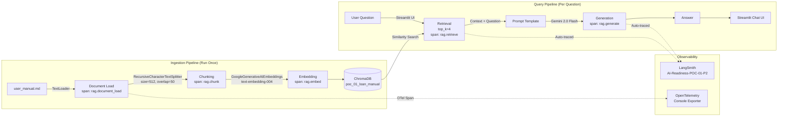

# Phase 2: RAG Application
## POC-01 — Loan Application Management System

**Phase Weight:** 20% | **Duration:** 5 days | **Test Cases:** 20

---

## 1. Phase Overview

### Objectives
In Phase 2, you will build an AI-powered Q&A chatbot that answers questions about the Loan Application Management System using the application's user manual as its knowledge source.

By the end of Phase 2, you will have:
- A complete LangChain RAG pipeline: document ingestion → chunking → embedding → ChromaDB storage → retrieval → generation
- A Streamlit chat interface where users can ask natural language questions about the loan application process
- LangSmith tracing capturing every query and retrieval
- OpenTelemetry spans covering each stage of the RAG pipeline
- A test suite validating ingestion quality, retrieval accuracy, and answer grounding

### Why This Matters
A loan officer or applicant often has questions about policy, procedures, and eligibility. Rather than searching through a PDF manual or calling a helpdesk, a RAG chatbot provides instant, accurate answers grounded in the actual documentation. This is the entry point to AI-augmented banking services.

### 5-Day Schedule

| Day | Focus | Activities |
|-----|-------|-----------|
| Day 1 | Concepts + Setup | Study RAG architecture, LangChain basics, ChromaDB setup, LangSmith account setup |
| Day 2 | Ingestion Pipeline | Build document ingestion: load user manual → chunk → embed → store in ChromaDB |
| Day 3 | Retrieval + Generation | Build retrieval chain, connect Gemini 2.0 Flash, test with sample questions |
| Day 4 | Streamlit UI + Observability | Build chat interface, add LangSmith tracing, add OTel spans |
| Day 5 | Testing + Refinement | Run all 20 test cases, tune chunk size/retrieval parameters, fix failures |

---

## 2. Prerequisites

- [ ] Phase 1 application running successfully on `http://localhost:8000`
- [ ] `requirements.txt` updated with Phase 2 packages (langchain, langchain-google-genai, chromadb, langsmith, streamlit)
- [ ] `GOOGLE_API_KEY` set in `.env` and tested (see TECH_STACK_REFERENCE.md Section 4.3)
- [ ] LangSmith account created, `LANGCHAIN_API_KEY` set in `.env` (see TECH_STACK_REFERENCE.md Section 5)
- [ ] `LANGCHAIN_PROJECT` set to `AI-Readiness-POC-01-P2`

---

## 3. Concepts to Self-Learn

| Concept | Search Term | Estimated Time |
|---------|-------------|----------------|
| RAG architecture overview | "Retrieval Augmented Generation explained 2024" | 30 min |
| LangChain RAG tutorial | "LangChain RAG tutorial langchain.com" | 60 min |
| ChromaDB getting started | "ChromaDB getting started guide" | 30 min |
| Text splitting strategies | "LangChain text splitters RecursiveCharacterTextSplitter" | 30 min |
| Google Generative AI embeddings | "langchain-google-genai embeddings tutorial" | 20 min |
| LangSmith tracing | "LangSmith tracing tutorial" | 30 min |
| Streamlit chat basics | "Streamlit chat message tutorial" | 30 min |

---

## 4. Technology Setup

### New Packages for Phase 2

```bash
pip install langchain==0.2.6 langchain-google-genai==1.0.6 langchain-community==0.2.6 \
            langchain-chroma==0.1.2 chromadb==0.5.3 langsmith==0.1.77 \
            streamlit==1.36.0
```

### Environment Variables to Add

```env
# Google AI Studio
GOOGLE_API_KEY=your-key-here

# LangSmith
LANGCHAIN_TRACING_V2=true
LANGCHAIN_API_KEY=your-langsmith-key
LANGCHAIN_PROJECT=AI-Readiness-POC-01-P2

# RAG Config
CHROMA_PERSIST_DIR=./chroma_db
CHUNK_SIZE=512
CHUNK_OVERLAP=50
TOP_K_RESULTS=4
```

### Project Structure Addition for Phase 2

```
poc-01-loan-app/
└── rag/                          ← New folder for Phase 2
    ├── ingest.py                 ← Document ingestion script
    ├── rag_chain.py              ← RAG chain builder
    ├── chatbot.py                ← Streamlit chat UI
    ├── user_manual.md            ← RAG knowledge source (copy content from Section 7 below)
    └── chroma_db/                ← Auto-created by ChromaDB
```

---

## 5. User Stories

### US-01-P2-01: Ingest User Manual
**Priority:** Must Have | **Story Points:** 3

> As a developer, I want to ingest the loan application system's user manual into ChromaDB, so that it can be used as the knowledge source for Q&A.

**Acceptance Criteria:**
- **Given** the user manual markdown file, **When** the ingestion script is run, **Then** the document is loaded, split into chunks, embedded, and stored in ChromaDB with a collection named `poc_01_loan_manual`
- **Given** the ingestion completes, **When** ChromaDB is queried for collection count, **Then** the count reflects the number of chunks created
- **Given** ingestion is run twice, **When** the second run happens, **Then** duplicate chunks are not added (use `get_or_create_collection` with `ids` for deduplication)

---

### US-01-P2-02: Answer Questions from Manual
**Priority:** Must Have | **Story Points:** 5

> As a loan applicant, I want to ask natural language questions about the loan application process, so that I get accurate, grounded answers without reading the entire manual.

**Acceptance Criteria:**
- **Given** the question "What documents are required for a home loan?", **When** asked to the chatbot, **Then** the answer correctly lists: id_proof, income_proof, bank_statement, property_docs, employment_letter
- **Given** a question about information not in the manual, **When** asked, **Then** the chatbot says it doesn't have that information rather than making something up
- **Given** any question, **When** the chatbot responds, **Then** the response is generated within 10 seconds

---

### US-01-P2-03: Chat Interface
**Priority:** Must Have | **Story Points:** 3

> As a user, I want a Streamlit chat interface to interact with the RAG chatbot, so that the experience feels like a natural conversation.

**Acceptance Criteria:**
- **Given** the Streamlit app runs, **When** I open `http://localhost:8501`, **Then** the chat interface is displayed with a text input and send button
- **Given** a question is typed and submitted, **When** the chatbot responds, **Then** the question and answer are both displayed in the chat history
- **Given** multiple questions asked in sequence, **When** the page is viewed, **Then** the full conversation history is shown

---

### US-01-P2-04: LangSmith Tracing
**Priority:** Must Have | **Story Points:** 2

> As a developer, I want every RAG query to create a LangSmith trace, so that I can debug retrieval quality and answer quality.

**Acceptance Criteria:**
- **Given** `LANGCHAIN_TRACING_V2=true`, **When** a question is asked to the chatbot, **Then** a trace appears in LangSmith project `AI-Readiness-POC-01-P2` within 30 seconds
- **Given** a LangSmith trace, **When** viewed, **Then** it shows: retriever call (with retrieved documents), LLM call (with prompt and response), and total latency

---

### US-01-P2-05: OpenTelemetry Spans
**Priority:** Must Have | **Story Points:** 2

> As a developer, I want OpenTelemetry spans for each RAG pipeline stage, so that I can measure performance at each step.

**Acceptance Criteria:**
- **Given** the ingestion script runs, **When** it completes, **Then** spans `rag.document_load`, `rag.chunk`, `rag.embed` appear in the console output
- **Given** a query is processed, **When** it completes, **Then** spans `rag.retrieve` and `rag.generate` appear with duration attributes

---

## 6. Architecture Diagram



---

## 7. User Manual (RAG Knowledge Source)

Copy the content below into `rag/user_manual.md`. This is your RAG corpus.

---

### LOAN APPLICATION MANAGEMENT SYSTEM — USER MANUAL

**Version 1.0 | Last Updated: June 2026**

---

#### SECTION 1: SYSTEM OVERVIEW

The Loan Application Management System (LAMS) is a digital platform that enables applicants to submit, track, and manage their loan applications entirely online. The system supports three types of loans: personal loans, home loans, and auto loans. The platform is accessible 24/7 from any web browser.

**Key Features:**
- Online loan application submission
- Real-time status tracking
- Document upload and verification tracking
- Loan officer review dashboard
- Branch manager analytics dashboard
- Automated status notifications

---

#### SECTION 2: USER ROLES AND PERMISSIONS

The system has three user roles:

**Applicant:** Can submit applications, upload documents, and track their own application status. Cannot view other applicants' data.

**Loan Officer:** Can view all applications, update application statuses, add review remarks, and verify documents. Cannot approve disbursements (requires manager role).

**Branch Manager:** Has full access including approval of disbursements, access to the analytics dashboard, and the ability to override status transitions in exceptional cases.

---

#### SECTION 3: LOAN APPLICATION WORKFLOW

The loan application follows this step-by-step workflow:

**Step 1 — Registration:** The applicant registers on the platform with their email, phone, and basic personal information.

**Step 2 — Application Submission:** The applicant fills in the loan application form with loan type, amount requested, tenure (in months), and purpose. The application is created with status `submitted`.

**Step 3 — Document Upload:** The applicant uploads metadata for supporting documents (id_proof, income_proof, bank_statement, and for home loans: property_docs; for employed applicants: employment_letter).

**Step 4 — Loan Officer Review:** A loan officer picks up the application and changes the status to `under_review`. They may request additional documents via remarks.

**Step 5 — Decision:** The loan officer either approves or rejects the application. If approved, status changes to `approved`. If rejected, the rejection reason is recorded in remarks.

**Step 6 — Disbursement:** For approved applications, the branch manager initiates disbursement, changing status to `disbursed`. The applicant is notified.

---

#### SECTION 4: DOCUMENT REQUIREMENTS

**Personal Loan:**
- ID Proof (Aadhaar/PAN/Passport) — mandatory
- Income Proof (last 3 months salary slips) — mandatory
- Bank Statement (last 6 months) — mandatory

**Home Loan:**
- ID Proof — mandatory
- Income Proof — mandatory
- Bank Statement — mandatory
- Property Documents (sale deed, NOC, building plan approval) — mandatory
- Employment Letter (for salaried applicants) — mandatory

**Auto Loan:**
- ID Proof — mandatory
- Income Proof — mandatory
- Bank Statement — mandatory
- Vehicle quotation or proforma invoice — mandatory

---

#### SECTION 5: LOAN ELIGIBILITY CRITERIA

**Personal Loan:**
- Age: 21–60 years
- Minimum annual income: ₹2,40,000 (₹20,000/month)
- Minimum CIBIL score: 650
- Employment: Salaried or self-employed
- Maximum loan amount: ₹25,00,000
- Tenure: 12–60 months

**Home Loan:**
- Age: 21–70 years (loan must be repaid before age 70)
- Minimum annual income: ₹4,80,000 (₹40,000/month)
- Minimum CIBIL score: 700
- EMI should not exceed 50% of monthly income
- Maximum LTV: 80% of property value
- Tenure: 12–360 months (up to 30 years)

**Auto Loan:**
- Age: 21–65 years
- Minimum annual income: ₹1,80,000 (₹15,000/month)
- Minimum CIBIL score: 600
- Maximum loan amount: 90% of vehicle value
- Tenure: 12–84 months

---

#### SECTION 6: STATUS TRANSITION RULES

Applications move through statuses in a defined sequence:

- **submitted → under_review:** Loan officer picks up the application for review
- **under_review → approved:** Loan officer approves after document verification
- **under_review → rejected:** Loan officer rejects with mandatory rejection reason
- **approved → disbursed:** Branch manager initiates fund disbursement
- **No backward transitions:** Once rejected, an application cannot be reopened (a new application must be submitted)

---

#### SECTION 7: EMI CALCULATION

EMI (Equated Monthly Installment) is calculated using the formula:

```
EMI = P × r × (1+r)^n / ((1+r)^n - 1)
```

Where:
- P = Principal loan amount
- r = Monthly interest rate (annual rate ÷ 12 ÷ 100)
- n = Number of monthly installments (tenure in months)

**Example:** ₹5,00,000 loan at 12% per annum for 36 months:
- r = 12/12/100 = 0.01
- EMI = 500000 × 0.01 × (1.01)^36 / ((1.01)^36 - 1) = ₹16,607/month

---

#### SECTION 8: USING THE DASHBOARD

The dashboard provides a real-time overview of all applications:

**Summary Statistics:**
- Total applications (all statuses)
- Applications by status (submitted, under_review, approved, rejected, disbursed)
- Applications by loan type (personal, home, auto)
- Total loan amount requested

**Accessing the Dashboard:**
1. Log in with Branch Manager credentials
2. Click "Dashboard" in the navigation menu
3. Statistics refresh every 5 minutes (or manually via the refresh button)

---

#### SECTION 9: PROCESSING TIME GUIDELINES

| Loan Type | Target Processing Time | Maximum Allowed Time |
|-----------|----------------------|---------------------|
| Personal Loan | 2–3 business days | 7 business days |
| Home Loan | 7–10 business days | 21 business days |
| Auto Loan | 1–2 business days | 5 business days |

Processing time is measured from application submission to final decision (approved/rejected).

---

#### SECTION 10: SECURITY AND PRIVACY

**Authentication:** All users must log in with email and password. Sessions expire after 24 hours of inactivity.

**Data Privacy:** Applicant financial data is encrypted at rest. Bank statements and salary slips are stored securely. Only authorized personnel can access applicant data.

**Audit Trail:** Every status change is recorded in the audit log with the user who made the change, timestamp, and remarks.

---

#### SECTION 11: FREQUENTLY ASKED QUESTIONS (FAQ)

**Q: How do I check the status of my loan application?**
A: Log in to the portal, go to "My Applications," and your current status is shown next to each application. Status updates in real time when a loan officer makes changes.

**Q: What is the minimum credit score required for a personal loan?**
A: The minimum CIBIL score for a personal loan is 650. For home loans, the minimum is 700. For auto loans, the minimum is 600.

**Q: How long does the loan approval process take?**
A: Personal loans are typically processed in 2–3 business days. Home loans take 7–10 business days. Auto loans take 1–2 business days.

**Q: What documents are required for a home loan?**
A: For a home loan you need: (1) ID Proof (Aadhaar/PAN/Passport), (2) Income Proof (last 3 months salary slips or IT returns for self-employed), (3) Bank Statement (last 6 months), (4) Property Documents (sale deed, NOC, building plan approval), (5) Employment Letter (for salaried applicants).

**Q: Can I apply for a loan without a CIBIL score?**
A: Applicants without a CIBIL score (e.g., first-time borrowers) may be considered for secured loans only (home or auto loans with collateral). Personal loans require a minimum CIBIL score.

**Q: What happens if my loan application is rejected?**
A: If rejected, you will receive the rejection reason via email and in the portal. You may submit a new application after 90 days. Common rejection reasons include: insufficient income, low CIBIL score, incomplete documents, or property valuation issues.

**Q: Can I modify my application after submission?**
A: Applications cannot be modified after submission. If you made an error, contact your loan officer to withdraw the application and submit a new one.

**Q: What is the maximum loan amount for a personal loan?**
A: The maximum personal loan amount is ₹25,00,000 (25 lakhs). The actual amount approved depends on your income, credit score, and existing debt obligations.

**Q: How is my EMI calculated?**
A: EMI is calculated using the standard formula: P × r × (1+r)^n / ((1+r)^n - 1), where P is the principal, r is the monthly interest rate, and n is the tenure in months. An EMI calculator is available on the dashboard.

**Q: Can I repay my loan early?**
A: Yes, pre-payment is allowed after a minimum lock-in period of 6 months for personal loans and 12 months for home loans. Pre-payment charges of 2% on outstanding principal may apply.

**Q: What is the difference between sanction amount and disbursement amount?**
A: The sanction amount is the loan amount approved by the bank. The disbursement amount is the actual funds transferred to your account, which may differ if processing fees or insurance premiums are deducted upfront.

**Q: I uploaded a wrong document — how do I replace it?**
A: Contact your loan officer via the portal's comment section. They can mark the incorrect document and you can upload the correct one. Only unverified documents can be replaced.

**Q: What is the interest rate?**
A: Interest rates vary by loan type, tenure, and applicant profile. Current indicative rates: Personal Loans: 10.99–18% p.a., Home Loans: 8.5–12% p.a., Auto Loans: 9–14% p.a. Final rates are communicated in the sanction letter.

**Q: Is there a processing fee?**
A: Yes, a processing fee of 0.5–2% of the loan amount applies, subject to a minimum of ₹500. This is deducted from the disbursed amount.

**Q: How do I contact my loan officer?**
A: Once your application is under review, your assigned loan officer's contact details are visible in the application detail page. You can also add comments to your application which the officer will see.

**Q: My application has been under review for more than 7 days — what should I do?**
A: Contact your branch's helpdesk if your application exceeds the target processing time. Personal loans should be resolved within 7 business days, home loans within 21 business days.

**Q: Can a co-applicant be added after submission?**
A: Co-applicant details must be included at the time of submission. Adding a co-applicant after submission requires withdrawing and resubmitting the application.

**Q: What is LTV (Loan-to-Value)?**
A: LTV is the loan amount as a percentage of the property's market value for home loans. Our maximum LTV is 80%, meaning if your property is valued at ₹50 lakhs, the maximum loan amount is ₹40 lakhs.

**Q: What employment types are eligible?**
A: Both salaried and self-employed individuals are eligible. Salaried applicants must have minimum 6 months employment with the current employer. Self-employed must have a business vintage of at least 2 years.

**Q: Are there any age restrictions?**
A: Personal loans: 21–60 years. Home loans: 21–70 years (loan must be fully repaid before age 70). Auto loans: 21–65 years.

**Q: How is my annual income verified?**
A: For salaried employees, income is verified via salary slips and Form 16. For self-employed, income is verified via ITR (Income Tax Returns) for the last 2 years.

---

#### SECTION 12: TROUBLESHOOTING

**Problem: Cannot log in**
Solution: Check that Caps Lock is off. Passwords are case-sensitive. If forgotten, use the "Forgot Password" link on the login page.

**Problem: Document upload fails**
Solution: Documents must be in PDF, JPG, or PNG format. Maximum file size is 5MB per document. Ensure your internet connection is stable.

**Problem: Application stuck in "submitted" status for more than 24 hours**
Solution: This is normal — loan officers review applications during business hours (Monday–Saturday, 9 AM – 6 PM). If status doesn't change after 2 business days, contact the helpdesk.

**Problem: EMI calculator shows different amount than expected**
Solution: Verify that the interest rate entered matches the rate quoted by your loan officer. Rates may differ from indicative rates based on your profile.

---

#### SECTION 13: GLOSSARY

| Term | Definition |
|------|-----------|
| CIBIL Score | Credit score from TransUnion CIBIL ranging 300–900; higher is better |
| EMI | Equated Monthly Installment — fixed monthly payment |
| LTV | Loan-to-Value ratio — loan as % of collateral value |
| KYC | Know Your Customer — identity verification process |
| Sanction Letter | Official loan approval document from the bank |
| Disbursement | Transfer of loan funds to the borrower |
| Collateral | Asset pledged as loan security |
| NPA | Non-Performing Asset — loan with overdue payments |
| FOIR | Fixed Obligation to Income Ratio — monthly obligations ÷ income |
| Pre-EMI | Interest-only payment before full loan disbursement |

---

## 8. Step-by-Step Implementation Guide

### Step 8.1: Document Ingestion Pipeline

```python
# rag/ingest.py
import os
import time
import structlog
from dotenv import load_dotenv
from langchain_community.document_loaders import TextLoader
from langchain.text_splitter import RecursiveCharacterTextSplitter
from langchain_google_genai import GoogleGenerativeAIEmbeddings
from langchain_chroma import Chroma
from opentelemetry import trace

load_dotenv()
logger = structlog.get_logger()

# Get tracer (from your otel_config.py)
tracer = trace.get_tracer("rag-ingest")

def ingest_manual(manual_path: str = "rag/user_manual.md"):
    log = logger.bind(poc_id="POC-01", phase=2, operation="ingest_manual")
    
    # Step 1: Load document
    with tracer.start_as_current_span("rag.document_load") as span:
        span.set_attribute("rag.source", manual_path)
        file_size = os.path.getsize(manual_path)
        span.set_attribute("rag.file_size_bytes", file_size)
        
        loader = TextLoader(manual_path, encoding="utf-8")
        documents = loader.load()
        span.set_attribute("rag.document_count", len(documents))
        log.info("document_loaded", file=manual_path, doc_count=len(documents))
    
    # Step 2: Split into chunks
    with tracer.start_as_current_span("rag.chunk") as span:
        chunk_size = int(os.getenv("CHUNK_SIZE", 512))
        chunk_overlap = int(os.getenv("CHUNK_OVERLAP", 50))
        span.set_attribute("rag.chunk_size", chunk_size)
        span.set_attribute("rag.chunk_overlap", chunk_overlap)
        
        splitter = RecursiveCharacterTextSplitter(
            chunk_size=chunk_size,
            chunk_overlap=chunk_overlap,
            separators=["\n\n", "\n", ". ", " ", ""]
        )
        chunks = splitter.split_documents(documents)
        span.set_attribute("rag.chunk_count", len(chunks))
        log.info("document_chunked", chunk_count=len(chunks), chunk_size=chunk_size)
    
    # Step 3: Embed and store
    with tracer.start_as_current_span("rag.embed") as span:
        span.set_attribute("rag.embedding_model", "text-embedding-004")
        
        embeddings = GoogleGenerativeAIEmbeddings(
            model="models/text-embedding-004",
            google_api_key=os.getenv("GOOGLE_API_KEY")
        )
        
        # Assign IDs for deduplication
        ids = [f"chunk_{i}" for i in range(len(chunks))]
        
        vectorstore = Chroma(
            collection_name="poc_01_loan_manual",
            embedding_function=embeddings,
            persist_directory=os.getenv("CHROMA_PERSIST_DIR", "./chroma_db")
        )
        
        # Add with IDs (overwrites if same ID exists)
        vectorstore.add_documents(chunks, ids=ids)
        span.set_attribute("rag.vectors_stored", len(chunks))
        log.info("vectors_stored", collection="poc_01_loan_manual", count=len(chunks))
    
    log.info("ingestion_complete", 
             chunks_created=len(chunks),
             collection="poc_01_loan_manual",
             status="success")
    return len(chunks)

if __name__ == "__main__":
    count = ingest_manual()
    print(f"Ingestion complete: {count} chunks stored in ChromaDB")
```

### Step 8.2: RAG Chain Builder

```python
# rag/rag_chain.py
import os
import time
import structlog
from dotenv import load_dotenv
from langchain_google_genai import ChatGoogleGenerativeAI, GoogleGenerativeAIEmbeddings
from langchain_chroma import Chroma
from langchain.prompts import ChatPromptTemplate
from langchain.schema.runnable import RunnablePassthrough
from langchain.schema.output_parser import StrOutputParser
from langsmith import traceable
from opentelemetry import trace

load_dotenv()
logger = structlog.get_logger()
tracer = trace.get_tracer("rag-chain")

RAG_PROMPT_TEMPLATE = """You are a helpful assistant for the Loan Application Management System.
Answer the user's question based ONLY on the provided context from the user manual.
If the answer is not in the context, say: "I don't have information about that in the user manual. Please contact our helpdesk."
Do not make up information not found in the context.

Context from user manual:
{context}

Question: {question}

Answer:"""

def build_rag_chain():
    embeddings = GoogleGenerativeAIEmbeddings(
        model="models/text-embedding-004",
        google_api_key=os.getenv("GOOGLE_API_KEY")
    )
    
    vectorstore = Chroma(
        collection_name="poc_01_loan_manual",
        embedding_function=embeddings,
        persist_directory=os.getenv("CHROMA_PERSIST_DIR", "./chroma_db")
    )
    
    retriever = vectorstore.as_retriever(
        search_type="similarity",
        search_kwargs={"k": int(os.getenv("TOP_K_RESULTS", 4))}
    )
    
    llm = ChatGoogleGenerativeAI(
        model="gemini-2.0-flash",
        google_api_key=os.getenv("GOOGLE_API_KEY"),
        temperature=0.1  # Low temperature for factual Q&A
    )
    
    prompt = ChatPromptTemplate.from_template(RAG_PROMPT_TEMPLATE)
    
    def format_docs(docs):
        return "\n\n".join(doc.page_content for doc in docs)
    
    chain = (
        {"context": retriever | format_docs, "question": RunnablePassthrough()}
        | prompt
        | llm
        | StrOutputParser()
    )
    
    return chain, retriever

@traceable(
    name="loan_rag_query",
    tags=["phase-2", "rag", "loan-app"],
    metadata={"poc_id": "POC-01", "phase": 2}
)
def answer_question(question: str, chain, retriever) -> dict:
    log = logger.bind(poc_id="POC-01", phase=2, operation="answer_question")
    start = time.time()
    
    with tracer.start_as_current_span("rag.retrieve") as span:
        span.set_attribute("rag.query", question)
        span.set_attribute("rag.top_k", int(os.getenv("TOP_K_RESULTS", 4)))
        retrieved_docs = retriever.invoke(question)
        span.set_attribute("rag.retrieved_count", len(retrieved_docs))
    
    with tracer.start_as_current_span("rag.generate") as span:
        span.set_attribute("rag.model", "gemini-2.0-flash")
        span.set_attribute("rag.context_chunks", len(retrieved_docs))
        answer = chain.invoke(question)
        span.set_attribute("rag.answer_length", len(answer))
    
    duration_ms = int((time.time() - start) * 1000)
    log.info("question_answered",
             question_length=len(question),
             retrieved_docs=len(retrieved_docs),
             answer_length=len(answer),
             duration_ms=duration_ms,
             status="success")
    
    return {
        "answer": answer,
        "source_documents": [doc.page_content[:200] for doc in retrieved_docs],
        "num_sources": len(retrieved_docs)
    }
```

### Step 8.3: Streamlit Chat Interface

```python
# rag/chatbot.py
import streamlit as st
from rag_chain import build_rag_chain, answer_question
from dotenv import load_dotenv

load_dotenv()

st.set_page_config(
    page_title="Loan Application Assistant",
    page_icon="🏦",
    layout="wide"
)

st.title("🏦 Loan Application Assistant")
st.caption("Ask questions about our loan application process, eligibility, and documentation requirements.")

# Initialize session state
if "messages" not in st.session_state:
    st.session_state.messages = []

if "rag_chain" not in st.session_state:
    with st.spinner("Loading knowledge base..."):
        chain, retriever = build_rag_chain()
        st.session_state.rag_chain = chain
        st.session_state.retriever = retriever
    st.success("Knowledge base loaded!")

# Display chat history
for message in st.session_state.messages:
    with st.chat_message(message["role"]):
        st.markdown(message["content"])
        if message["role"] == "assistant" and "sources" in message:
            with st.expander("📄 Source Excerpts"):
                for i, src in enumerate(message["sources"], 1):
                    st.text(f"Source {i}: {src[:300]}...")

# Chat input
if prompt := st.chat_input("Ask about loan application process..."):
    # Add user message
    st.session_state.messages.append({"role": "user", "content": prompt})
    with st.chat_message("user"):
        st.markdown(prompt)
    
    # Generate response
    with st.chat_message("assistant"):
        with st.spinner("Searching knowledge base..."):
            result = answer_question(
                prompt,
                st.session_state.rag_chain,
                st.session_state.retriever
            )
        
        st.markdown(result["answer"])
        with st.expander(f"📄 Based on {result['num_sources']} sources"):
            for i, src in enumerate(result["source_documents"], 1):
                st.text(f"Source {i}: {src}...")
        
        st.session_state.messages.append({
            "role": "assistant",
            "content": result["answer"],
            "sources": result["source_documents"]
        })

# Sidebar
with st.sidebar:
    st.header("Sample Questions")
    sample_questions = [
        "What documents are required for a home loan?",
        "What is the minimum credit score for a personal loan?",
        "How long does loan approval take?",
        "How is my EMI calculated?",
        "What happens if my application is rejected?"
    ]
    for q in sample_questions:
        if st.button(q, key=q):
            st.session_state.messages.append({"role": "user", "content": q})
            st.rerun()
```

### Running Phase 2

```bash
# Step 1: Run ingestion (one time)
cd rag
python ingest.py

# Step 2: Start the chatbot
streamlit run chatbot.py

# Chatbot available at: http://localhost:8501
```

---

## 9. Logging & Observability Requirements

| Event | Level | Required Fields |
|-------|-------|----------------|
| Ingestion started | INFO | file_path, poc_id, phase=2 |
| Document loaded | INFO | doc_count, file_size_bytes |
| Chunking complete | INFO | chunk_count, chunk_size, chunk_overlap |
| Vectors stored | INFO | collection_name, vector_count |
| Question received | INFO | question_length, session_id |
| Retrieval complete | INFO | retrieved_count, duration_ms |
| Answer generated | INFO | answer_length, duration_ms, status |
| LLM error | ERROR | error_type, question, duration_ms |

**LangSmith:** Every call to `answer_question()` must create a trace in project `AI-Readiness-POC-01-P2`.

**OTel Spans:** `rag.document_load`, `rag.chunk`, `rag.embed` during ingestion; `rag.retrieve`, `rag.generate` during queries.

---

## 10. Test Case Specifications Summary

| # | Test ID | Category | Description |
|---|---------|----------|-------------|
| 1-4 | TC-01-P2-ING-01 to 04 | Ingestion | Document load, chunk sizes, embeddings generated, ChromaDB persistence |
| 5-10 | TC-01-P2-RET-01 to 06 | Retrieval | Relevant chunk returned, top-k count, irrelevant query low similarity, latency |
| 11-16 | TC-01-P2-GEN-01 to 06 | Generation | Grounded answer, correct doc requirements, FAQ answer, no hallucination, format |
| 17-20 | TC-01-P2-OBS-01 to 04 | Observability | LangSmith trace, OTel spans, log fields, trace metadata |

See `tests/phase2-test-spec.md` for full details.

---

## 11. Submission Checklist

- [ ] `user_manual.md` file exists in `rag/` folder with content from Section 7
- [ ] `ingest.py` runs successfully and creates ChromaDB collection
- [ ] `python -c "import chromadb; c=chromadb.PersistentClient('./chroma_db'); print(c.get_collection('poc_01_loan_manual').count())"` shows > 0 chunks
- [ ] `chatbot.py` starts with `streamlit run chatbot.py` without errors
- [ ] Chatbot correctly answers the 5 sample questions from Step 8.3 sidebar
- [ ] Chatbot says "I don't have information" for out-of-scope questions (e.g., "What is the capital of France?")
- [ ] LangSmith project `AI-Readiness-POC-01-P2` shows traces after querying
- [ ] OTel spans appear in console output (document_load, chunk, embed, retrieve, generate)
- [ ] All log events include poc_id=POC-01 and phase=2
- [ ] At least 14 of 20 test cases pass

---

## 12. Common Mistakes & Tips

| # | Mistake | Fix |
|---|---------|-----|
| 1 | `load_dotenv()` not called before LangChain imports | Move `load_dotenv()` to top of every script |
| 2 | ChromaDB "dimension mismatch" error | Delete `./chroma_db` folder and re-run ingest |
| 3 | LangSmith traces not appearing | Check `LANGCHAIN_TRACING_V2=true` (not "True" — exact lowercase) |
| 4 | "I don't know" for everything | ChromaDB collection empty — re-run `ingest.py` |
| 5 | Gemini rate limit errors | Add `time.sleep(4)` between batch embedding calls |
| 6 | Very slow embedding during ingest | Normal — 512-token chunks with text-embedding-004 take ~0.5s each |
| 7 | Answer not using retrieved context | Check RAG prompt template — ensure `{context}` placeholder is present |
| 8 | `chunk_size` too large | Chunks > 1000 tokens may exceed embedding model limits; keep at 512 |
