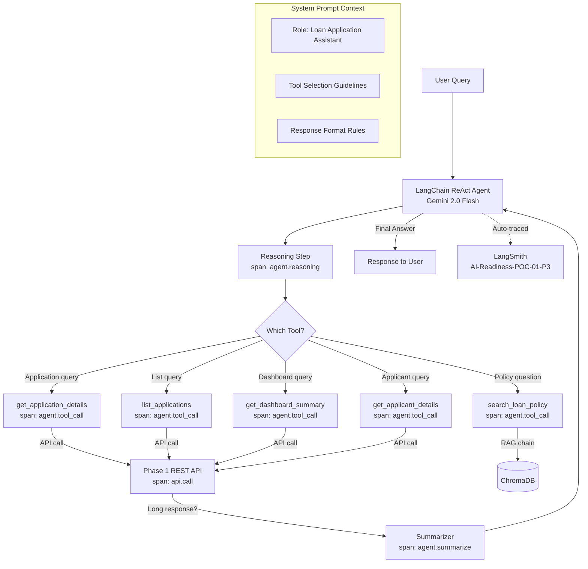

# Phase 3: Context Engineering & Tool Integration
## POC-01 — Loan Application Management System

**Phase Weight:** 20% | **Duration:** 5 days | **Test Cases:** 20

---

## 1. Phase Overview

### Objectives
Phase 3 transforms the static RAG chatbot from Phase 2 into a **context-aware, tool-integrated agent**. The agent can now answer questions using BOTH the user manual (RAG) AND live data from the Phase 1 REST API. It reasons about which tool to use and chains multiple tools together when needed.

By the end of Phase 3, you will have:
- A LangChain ReAct agent with 5 custom tools
- Tools that call Phase 1 REST API endpoints and return structured data
- A summarization chain for compressing long API responses
- A context-engineered system prompt with role definition and tool guidance
- Full tool call tracing in LangSmith and OTel

### Why This Matters
A loan officer using the chatbot needs more than policy answers — they need to look up real application data. "Is application #123 approved?" requires calling the live database. "What does policy say about home loans AND how many home loan applications are pending?" requires BOTH a RAG call AND an API call. Phase 3 makes this possible.

### 5-Day Schedule

| Day | Focus | Activities |
|-----|-------|-----------|
| Day 1 | Concepts + ReAct | Study LangChain agents, ReAct pattern, tool definition with `@tool` decorator |
| Day 2 | Tool Implementation | Build all 5 tools, test each tool independently with direct calls |
| Day 3 | Agent + Prompt Engineering | Build the ReAct agent, design system prompt, test with sample queries |
| Day 4 | Summarization + Observability | Add summarization chain, add OTel spans, update LangSmith project |
| Day 5 | Testing + Refinement | Run all 20 test cases, handle edge cases, test multi-tool queries |

---

## 2. Prerequisites

- [ ] Phase 1 backend running on `http://localhost:8000`
- [ ] Phase 2 RAG chain built and ChromaDB populated
- [ ] Valid JWT token from Phase 1 (for tool authentication)
- [ ] `LANGCHAIN_PROJECT` updated to `AI-Readiness-POC-01-P3`
- [ ] `API_BASE_URL=http://localhost:8000` in `.env`
- [ ] `API_JWT_TOKEN=your-jwt-token-from-phase1-login` in `.env`

---

## 3. Concepts to Self-Learn

| Concept | Search Term | Estimated Time |
|---------|-------------|----------------|
| LangChain agents overview | "LangChain agents tutorial 2024" | 45 min |
| ReAct pattern | "ReAct reasoning acting LLM paper explained" | 30 min |
| LangChain @tool decorator | "LangChain tool decorator custom tools" | 30 min |
| LangChain create_react_agent | "LangChain create_react_agent tutorial" | 45 min |
| Prompt engineering for agents | "System prompts for LangChain agents" | 30 min |
| LangChain summarization chain | "LangChain summarize text chain" | 20 min |

---

## 4. Project Structure Addition

```
poc-01-loan-app/
└── agent/                         ← New folder for Phase 3
    ├── tools.py                   ← All 5 tool definitions
    ├── agent.py                   ← ReAct agent builder
    ├── prompts.py                 ← System prompt templates
    ├── summarizer.py              ← Summarization chain
    └── agent_app.py               ← Streamlit UI for agent
```

---

## 5. User Stories

### US-01-P3-01: Get Application Status Tool
**Priority:** Must Have | **Story Points:** 2

> As a tool, I want to retrieve a loan application's full details from the Phase 1 API, so that the agent can answer questions about specific applications.

**Acceptance Criteria:**
- **Given** a valid application_id, **When** the tool is called, **Then** it returns the application details as a formatted string including status, applicant name, loan type, amount, and latest status remark
- **Given** an invalid application_id, **When** the tool is called, **Then** it returns "Application not found" rather than throwing an exception
- **Given** the Phase 1 API is unavailable, **When** the tool is called, **Then** it returns a descriptive error message and does not crash the agent

---

### US-01-P3-02: List Applications Tool
**Priority:** Must Have | **Story Points:** 2

> As a tool, I want to retrieve filtered lists of applications, so that the agent can answer questions like "How many applications are pending review?"

**Acceptance Criteria:**
- **Given** status and loan_type filters, **When** the tool is called, **Then** it returns a summary of matching applications (count + brief list)
- **Given** a long list of applications, **When** returned, **Then** the response is summarized to prevent context overflow
- **Given** no matching applications, **When** the tool is called, **Then** it returns "No applications found matching the criteria"

---

### US-01-P3-03: Multi-Tool Reasoning
**Priority:** Must Have | **Story Points:** 5

> As a loan officer, I want to ask questions that require both policy lookup and live data, so that I get comprehensive answers in a single query.

**Acceptance Criteria:**
- **Given** the query "What is the status of application 5 and what does the policy say about home loans?", **When** asked to the agent, **Then** it calls BOTH `get_application_details` tool AND `search_loan_policy` tool, then synthesizes the answer
- **Given** the query "Summarize all under_review applications", **When** asked, **Then** the agent calls `list_applications` with status=under_review and returns a human-readable summary
- **Given** a query the agent can answer from the manual alone, **When** asked, **Then** the agent uses `search_loan_policy` and does NOT make unnecessary API calls

---

### US-01-P3-04: Context-Engineered System Prompt
**Priority:** Must Have | **Story Points:** 3

> As a developer, I want the agent to have a well-structured system prompt that defines its role, available tools, and reasoning guidance, so that it behaves consistently and professionally.

**Acceptance Criteria:**
- **Given** the system prompt, **When** the agent introduces itself, **Then** it identifies as a loan application assistant (not a generic AI)
- **Given** an out-of-scope question, **When** asked, **Then** the agent declines politely and redirects to its purpose
- **Given** the system prompt includes tool selection guidelines, **When** the agent reasons, **Then** it prefers live data tools for specific application queries and RAG tools for policy questions

---

### US-01-P3-05: Summarization of Long Responses
**Priority:** Must Have | **Story Points:** 2

> As a developer, I want long API responses to be summarized before being sent to the LLM, so that the agent's context window is not overloaded.

**Acceptance Criteria:**
- **Given** an API response longer than 2000 characters, **When** returned by a tool, **Then** it is automatically summarized using a summarization chain before being returned to the agent
- **Given** a short API response (< 2000 chars), **When** returned, **Then** it is returned as-is without summarization
- **Given** summarization occurs, **When** the OTel `agent.summarize` span is viewed, **Then** input_length and output_length attributes are present

---

## 6. Architecture Diagram



---

## 7. Step-by-Step Implementation Guide

### Step 7.1: Tool Definitions

```python
# agent/tools.py
import os
import time
import requests
import structlog
from langchain.tools import tool
from opentelemetry import trace

logger = structlog.get_logger()
tracer = trace.get_tracer("agent-tools")

API_BASE_URL = os.getenv("API_BASE_URL", "http://localhost:8000/api/v1")
API_TOKEN = os.getenv("API_JWT_TOKEN", "")

def _get_headers():
    return {"Authorization": f"Bearer {API_TOKEN}"}

def _call_api(method: str, endpoint: str, params: dict = None) -> dict:
    """Internal helper for API calls with OTel tracing."""
    url = f"{API_BASE_URL}{endpoint}"
    log = logger.bind(poc_id="POC-01", phase=3, operation="api_call")
    
    with tracer.start_as_current_span("api.call") as span:
        span.set_attribute("api.endpoint", endpoint)
        span.set_attribute("api.method", method.upper())
        start = time.time()
        try:
            response = requests.request(method, url, headers=_get_headers(), params=params, timeout=10)
            span.set_attribute("api.status_code", response.status_code)
            duration_ms = int((time.time() - start) * 1000)
            log.info("api_called", endpoint=endpoint, status_code=response.status_code, duration_ms=duration_ms)
            response.raise_for_status()
            return response.json()
        except requests.exceptions.ConnectionError:
            log.error("api_unavailable", endpoint=endpoint)
            span.set_attribute("api.error", "connection_refused")
            return {"error": "Phase 1 API is unavailable. Please ensure it is running on port 8000."}
        except requests.exceptions.HTTPError as e:
            log.warning("api_http_error", endpoint=endpoint, status=response.status_code)
            return {"error": f"API returned {response.status_code}: {response.text}"}

def _summarize_if_long(text: str, threshold: int = 2000) -> str:
    """Summarize text if it exceeds threshold characters."""
    if len(text) <= threshold:
        return text
    
    from agent.summarizer import summarize_text
    return summarize_text(text)


@tool
def get_application_details(application_id: str) -> str:
    """Retrieve complete details of a specific loan application including status history.
    Use this when the user asks about a specific application by its ID.
    Input: application_id (string, e.g., '1' or '42')"""
    
    log = logger.bind(poc_id="POC-01", phase=3, operation="get_application_details")
    
    with tracer.start_as_current_span("agent.tool_call") as span:
        span.set_attribute("tool.name", "get_application_details")
        span.set_attribute("tool.input", application_id)
        
        data = _call_api("GET", f"/applications/{application_id}")
        
        if "error" in data:
            return data["error"]
        if not data:
            return f"Application {application_id} not found."
        
        result = f"""Application ID: {data.get('id')}
Loan Type: {data.get('loan_type')}
Amount Requested: ₹{data.get('amount_requested'):,.0f}
Tenure: {data.get('tenure_months')} months
Status: {data.get('status').upper()}
Submitted: {data.get('submitted_at', 'N/A')[:10]}
Purpose: {data.get('purpose', 'N/A')}"""
        
        if data.get('status_history'):
            latest = data['status_history'][-1]
            result += f"\nLatest Update: {latest.get('new_status')} by {latest.get('changed_by')} — {latest.get('remarks', 'No remarks')}"
        
        span.set_attribute("tool.output_length", len(result))
        log.info("tool_executed", tool="get_application_details", application_id=application_id, status="success")
        return result


@tool
def list_applications(status: str = "", loan_type: str = "") -> str:
    """List loan applications with optional filters by status and loan type.
    Use this when asked about multiple applications or pipeline status.
    Input: status (optional: submitted/under_review/approved/rejected/disbursed), 
           loan_type (optional: personal/home/auto)"""
    
    with tracer.start_as_current_span("agent.tool_call") as span:
        span.set_attribute("tool.name", "list_applications")
        
        params = {}
        if status:
            params["status"] = status
        if loan_type:
            params["loan_type"] = loan_type
        
        data = _call_api("GET", "/applications", params=params)
        
        if "error" in data:
            return data["error"]
        
        items = data.get("items", data if isinstance(data, list) else [])
        total = data.get("total_count", len(items))
        
        if not items:
            filter_desc = f" with status={status}" if status else ""
            filter_desc += f" and loan_type={loan_type}" if loan_type else ""
            return f"No applications found{filter_desc}."
        
        summary = f"Found {total} application(s)"
        if status:
            summary += f" with status '{status}'"
        if loan_type:
            summary += f" of type '{loan_type}'"
        summary += ":\n"
        
        for app in items[:10]:  # Limit to 10 for context
            summary += f"- ID {app.get('id')}: {app.get('loan_type')} loan ₹{app.get('amount_requested'):,.0f} — {app.get('status')}\n"
        
        if total > 10:
            summary += f"... and {total - 10} more."
        
        span.set_attribute("tool.output_length", len(summary))
        return _summarize_if_long(summary)


@tool
def get_dashboard_summary() -> str:
    """Get the dashboard summary showing total applications by status and loan type.
    Use this for overview questions like 'how many applications are there' or 'what is the pipeline status'."""
    
    with tracer.start_as_current_span("agent.tool_call") as span:
        span.set_attribute("tool.name", "get_dashboard_summary")
        
        data = _call_api("GET", "/dashboard/summary")
        
        if "error" in data:
            return data["error"]
        
        result = "Dashboard Summary:\n"
        result += f"Total Applications: {data.get('total_applications', 0)}\n"
        result += f"Total Amount Requested: ₹{data.get('total_amount_requested', 0):,.0f}\n\n"
        result += "By Status:\n"
        for status, count in data.get('by_status', {}).items():
            result += f"  {status}: {count}\n"
        result += "\nBy Loan Type:\n"
        for loan_type, count in data.get('by_loan_type', {}).items():
            result += f"  {loan_type}: {count}\n"
        
        span.set_attribute("tool.output_length", len(result))
        return result


@tool
def search_loan_policy(query: str) -> str:
    """Search the loan application policy manual to answer questions about procedures, eligibility, and requirements.
    Use this for questions about: document requirements, eligibility criteria, processing times, EMI calculation, 
    loan types, status rules, fees, and general process questions.
    Input: query (natural language question about loan policies)"""
    
    with tracer.start_as_current_span("agent.tool_call") as span:
        span.set_attribute("tool.name", "search_loan_policy")
        span.set_attribute("tool.query", query)
        
        # Import here to avoid circular imports
        from rag.rag_chain import build_rag_chain, answer_question
        
        if not hasattr(search_loan_policy, '_chain'):
            search_loan_policy._chain, search_loan_policy._retriever = build_rag_chain()
        
        result = answer_question(query, search_loan_policy._chain, search_loan_policy._retriever)
        answer = result["answer"]
        
        span.set_attribute("tool.output_length", len(answer))
        return answer


@tool
def get_applicant_details(applicant_id: str) -> str:
    """Retrieve details about a specific loan applicant including their profile and credit information.
    Use this when asked about an applicant's background, credit score, or income.
    Input: applicant_id (string, numeric ID)"""
    
    with tracer.start_as_current_span("agent.tool_call") as span:
        span.set_attribute("tool.name", "get_applicant_details")
        
        data = _call_api("GET", f"/applicants/{applicant_id}")
        
        if "error" in data:
            return data["error"]
        
        result = f"""Applicant ID: {data.get('id')}
Name: {data.get('name')}
Email: {data.get('email')}
Employment Status: {data.get('employment_status')}
Annual Income: ₹{data.get('annual_income', 0):,.0f}
Credit Score: {data.get('credit_score', 'Not provided')}"""
        
        span.set_attribute("tool.output_length", len(result))
        return result
```

### Step 7.2: Summarization Chain

```python
# agent/summarizer.py
import os
import time
import structlog
from langchain_google_genai import ChatGoogleGenerativeAI
from langchain.prompts import PromptTemplate
from langchain.chains.summarize import load_summarize_chain
from langchain.docstore.document import Document
from opentelemetry import trace

logger = structlog.get_logger()
tracer = trace.get_tracer("agent-summarizer")

SUMMARIZE_PROMPT = """Summarize the following data from a loan application system concisely.
Keep key facts: IDs, statuses, amounts, and counts. Remove redundant information.
Data: {text}
Summary:"""

def summarize_text(text: str) -> str:
    """Summarize long text to prevent context overflow."""
    log = logger.bind(poc_id="POC-01", phase=3, operation="summarize")
    start = time.time()
    
    with tracer.start_as_current_span("agent.summarize") as span:
        input_length = len(text)
        span.set_attribute("summarize.input_length", input_length)
        
        llm = ChatGoogleGenerativeAI(
            model="gemini-2.0-flash",
            google_api_key=os.getenv("GOOGLE_API_KEY"),
            temperature=0
        )
        
        prompt = PromptTemplate(template=SUMMARIZE_PROMPT, input_variables=["text"])
        docs = [Document(page_content=text)]
        chain = load_summarize_chain(llm, chain_type="stuff", prompt=prompt)
        summary = chain.invoke({"input_documents": docs})["output_text"]
        
        output_length = len(summary)
        span.set_attribute("summarize.output_length", output_length)
        span.set_attribute("summarize.compression_ratio", round(output_length / input_length, 2))
        
        log.info("summarization_complete",
                 input_length=input_length,
                 output_length=output_length,
                 duration_ms=int((time.time() - start) * 1000))
        return summary
```

### Step 7.3: System Prompt & Agent Builder

```python
# agent/prompts.py
LOAN_AGENT_SYSTEM_PROMPT = """You are a professional Loan Application Assistant for a banking system.
Your role is to help loan officers and branch managers with information about loan applications and policies.

AVAILABLE TOOLS AND WHEN TO USE THEM:
1. get_application_details: Use when the user asks about a SPECIFIC application by ID (e.g., "What is the status of application 5?")
2. list_applications: Use when the user asks about MULTIPLE applications or pipeline status (e.g., "How many applications are under review?")
3. get_dashboard_summary: Use for OVERVIEW questions about all applications (e.g., "What is the current pipeline status?")
4. search_loan_policy: Use for POLICY questions about procedures, eligibility, documents, fees (e.g., "What documents are needed for a home loan?")
5. get_applicant_details: Use when asked about a SPECIFIC APPLICANT's profile (e.g., "What is the credit score of applicant 3?")

RESPONSE GUIDELINES:
- Always be professional and precise
- Include specific values (amounts, dates, statuses) in your responses
- If a question requires both live data and policy information, use both tools
- If the information is not available, clearly say so
- Do not make up application IDs, amounts, or policy details

SCOPE:
- Only answer questions related to loan applications and banking processes
- For unrelated questions, politely redirect: "I'm specialized in loan application management. How can I help you with that?"
"""
```

```python
# agent/agent.py
import os
from dotenv import load_dotenv
from langchain_google_genai import ChatGoogleGenerativeAI
from langchain.agents import create_react_agent, AgentExecutor
from langchain import hub
from agent.tools import (
    get_application_details, list_applications, 
    get_dashboard_summary, search_loan_policy, get_applicant_details
)
from agent.prompts import LOAN_AGENT_SYSTEM_PROMPT
from langsmith import traceable

load_dotenv()

TOOLS = [
    get_application_details,
    list_applications,
    get_dashboard_summary,
    search_loan_policy,
    get_applicant_details
]

def build_agent():
    llm = ChatGoogleGenerativeAI(
        model="gemini-2.0-flash",
        google_api_key=os.getenv("GOOGLE_API_KEY"),
        temperature=0
    )
    
    # Use LangChain hub prompt or create custom
    from langchain.prompts import PromptTemplate
    prompt = PromptTemplate.from_template(
        LOAN_AGENT_SYSTEM_PROMPT + """

Tools available:
{tools}

Tool names: {tool_names}

Use this format:
Question: the input question
Thought: reason about what to do
Action: tool_name
Action Input: tool input
Observation: tool result
... (repeat Thought/Action/Observation as needed)
Thought: I now have enough information
Final Answer: the final answer

Question: {input}
Thought: {agent_scratchpad}"""
    )
    
    agent = create_react_agent(llm, TOOLS, prompt)
    
    executor = AgentExecutor(
        agent=agent,
        tools=TOOLS,
        verbose=True,
        max_iterations=8,
        handle_parsing_errors=True,
        return_intermediate_steps=True
    )
    
    return executor

@traceable(
    name="loan_agent_query",
    tags=["phase-3", "agent"],
    metadata={"poc_id": "POC-01", "phase": 3}
)
def run_agent(query: str, executor) -> dict:
    result = executor.invoke(
        {"input": query},
        config={"metadata": {"poc_id": "POC-01", "phase": 3}}
    )
    return result
```

### Step 7.4: Running Phase 3

```bash
# Start Phase 1 API (must be running)
cd backend && uvicorn app.main:app --reload --port 8000

# In a new terminal, test the agent
cd agent
python -c "
from agent import build_agent, run_agent
executor = build_agent()
result = run_agent('What is the status of application 1?', executor)
print(result['output'])
"

# Start agent UI
streamlit run agent_app.py
```

---

## 8. Logging & Observability Requirements

| Event | Level | Required OTel Span |
|-------|-------|-------------------|
| Tool called | INFO | `agent.tool_call` with tool.name, tool.input |
| API called from tool | INFO | `api.call` with api.endpoint, api.method, api.status_code |
| Summarization triggered | INFO | `agent.summarize` with input_length, output_length |
| Agent reasoning step | DEBUG | `agent.reasoning` with agent.step, agent.thought |
| Tool error | ERROR | error in `agent.tool_call` span |

---

## 9. Test Case Specifications Summary

| # | Test ID | Category | Description |
|---|---------|----------|-------------|
| 1-4 | TC-01-P3-TOOL-01 to 04 | Tool Definition | Schema valid, tools registered, descriptions present, input validation |
| 5-10 | TC-01-P3-EXEC-01 to 06 | Tool Execution | Each tool returns correct data, error handling, API unavailable |
| 11-14 | TC-01-P3-CTX-01 to 04 | Context Mgmt | System prompt rendered, long response summarized, context within limits |
| 15-20 | TC-01-P3-E2E-01 to 06 | End-to-End | Status query, multi-tool, policy+data, summarize list, ambiguous query, trace |

See `tests/phase3-test-spec.md` for full details.

---

## 10. Submission Checklist

- [ ] All 5 tools implemented with `@tool` decorator, name, and description
- [ ] Agent answers "What is the status of application 1?" correctly (calls get_application_details)
- [ ] Agent answers "What documents are needed for a home loan?" correctly (calls search_loan_policy)
- [ ] Agent answers multi-tool query: "Status of app 1 AND home loan document policy" (calls both tools)
- [ ] Summarization triggers for responses > 2000 chars
- [ ] `agent.tool_call` OTel spans appear in console for each tool invocation
- [ ] `api.call` OTel spans appear for each REST API call
- [ ] LangSmith project `AI-Readiness-POC-01-P3` shows traces with tool calls visible
- [ ] At least 14 of 20 test cases pass

---

## 11. Common Mistakes & Tips

| Mistake | Fix |
|---------|-----|
| Phase 1 API not running when testing tools | Always start backend before running agent tests |
| JWT token expired | Re-login to Phase 1 API and update `API_JWT_TOKEN` in `.env` |
| Agent stuck in infinite loop | Set `max_iterations=8` in AgentExecutor |
| Tool description too vague | LLM can't select correct tool — make description very specific about WHEN to use each tool |
| Context window exceeded | Add summarization chain for long list responses |
| Agent makes up application IDs | Tighten system prompt: "Do not invent application IDs or amounts" |
