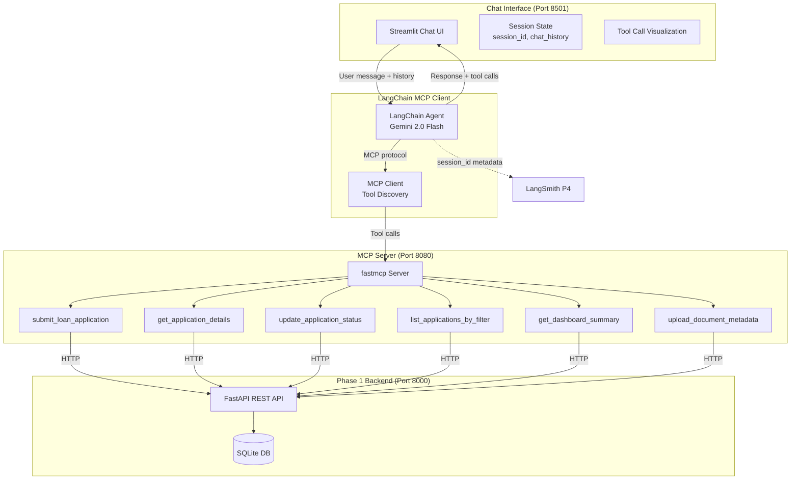

# Phase 4: MCP Server & Chat Interface
## POC-01 — Loan Application Management System

**Phase Weight:** 25% | **Duration:** 5 days | **Test Cases:** 25

---

## 1. Phase Overview

### Objectives
Phase 4 converts the Phase 1 REST API into a **Model Context Protocol (MCP) server** and builds a polished **Streamlit chat interface**. Bank staff can now interact with the entire loan management system through natural language conversations — no forms, no API calls, just chat.

By the end of Phase 4, you will have:
- A `fastmcp` MCP server exposing 6 loan management tools
- A LangChain MCP client that discovers and invokes tools via the MCP protocol
- A Streamlit chat interface with conversation history, session management, and tool call visualization
- Full observability: every MCP tool call traced in LangSmith with session ID

### Why MCP?
The Model Context Protocol (MCP) is an open standard (created by Anthropic) that defines how AI applications communicate with external tools and data sources. By converting your REST API to MCP, you make it universally consumable by any MCP-compatible AI client — not just your LangChain agent. This is the emerging standard for AI-tool integration.

### 5-Day Schedule

| Day | Focus | Activities |
|-----|-------|-----------|
| Day 1 | Concepts + MCP Setup | Study MCP protocol, fastmcp library, install and test basic MCP server |
| Day 2 | MCP Server | Build MCP server with all 6 tools, test each tool via MCP client |
| Day 3 | LangChain Integration | Connect LangChain to MCP server, test tool discovery and invocation |
| Day 4 | Streamlit Chat UI | Build full chat interface with history, session management, tool visualization |
| Day 5 | Observability + Testing | Add LangSmith tracing with session IDs, run all 25 test cases |

---

## 2. Prerequisites

- [ ] Phase 1 backend running on `http://localhost:8000`
- [ ] Phase 3 agent tools working (to understand the tool patterns)
- [ ] `fastmcp` installed: `pip install fastmcp==0.4.1`
- [ ] `LANGCHAIN_PROJECT` updated to `AI-Readiness-POC-01-P4`
- [ ] `API_JWT_TOKEN` in `.env` (valid JWT from Phase 1 login)

---

## 3. Concepts to Self-Learn

| Concept | Search Term | Estimated Time |
|---------|-------------|----------------|
| What is MCP? | "Model Context Protocol Anthropic explained" | 30 min |
| fastmcp quickstart | "fastmcp Python quickstart github" | 45 min |
| MCP client in LangChain | "LangChain MCP client tutorial" | 45 min |
| Streamlit session state | "Streamlit session_state tutorial" | 20 min |
| Streamlit chat_message | "Streamlit st.chat_message documentation" | 20 min |

---

## 4. Project Structure Addition

```
poc-01-loan-app/
└── mcp_server/                   ← New folder for Phase 4
    ├── mcp_app.py                ← fastmcp server definition
    ├── chat_interface.py         ← Streamlit chat UI with MCP
    └── mcp_client.py             ← LangChain MCP client helper
```

---

## 5. User Stories

### US-01-P4-01: MCP Server with Loan Tools
**Priority:** Must Have | **Story Points:** 5

> As a developer, I want to expose all loan management operations as MCP tools, so that any MCP-compatible AI client can perform loan management tasks.

**Acceptance Criteria:**
- **Given** the MCP server is running, **When** a client lists tools, **Then** it discovers all 6 tools with their names, descriptions, and input schemas
- **Given** `submit_loan_application` is called with valid inputs, **When** executed, **Then** it creates a new application in the Phase 1 database and returns the new application ID
- **Given** invalid input (missing required field), **When** a tool is called, **Then** it returns an MCP error response with a clear message

---

### US-01-P4-02: Conversational Loan Management
**Priority:** Must Have | **Story Points:** 5

> As a loan officer, I want to manage loan applications through natural language chat, so that I can complete tasks without navigating multiple forms.

**Acceptance Criteria:**
- **Given** the chat interface, **When** I type "Show me all pending applications", **Then** the system calls `list_applications_by_filter` with status=submitted and displays the results conversationally
- **Given** I type "Approve application 3 — all documents verified", **When** processed, **Then** the system calls `update_application_status` with new_status=approved and remarks="all documents verified"
- **Given** a multi-turn conversation where I first ask about application 5 and then say "approve it", **When** processed, **Then** the context from the previous turn (application_id=5) is maintained

---

### US-01-P4-03: Chat Interface with Tool Visualization
**Priority:** Must Have | **Story Points:** 3

> As a user, I want the chat interface to show which MCP tools were called for each response, so that I understand what actions the AI took.

**Acceptance Criteria:**
- **Given** a response that required a tool call, **When** the response is displayed, **Then** an expandable "Tools Used" section shows the tool name and input
- **Given** a multi-tool response, **When** expanded, **Then** all tool calls are listed in order
- **Given** a pure conversational response (no tools needed), **When** displayed, **Then** no "Tools Used" section is shown

---

### US-01-P4-04: Session Management
**Priority:** Must Have | **Story Points:** 2

> As a user, I want my chat session to persist while I'm in the app, so that I can have a continuous conversation without losing context.

**Acceptance Criteria:**
- **Given** the chat app starts, **When** a session is initialized, **Then** a unique session_id is generated and stored in `st.session_state`
- **Given** multiple messages in a session, **When** the conversation history is viewed, **Then** all messages (user and assistant) are displayed in order
- **Given** the app is refreshed, **When** a new session starts, **Then** a new session_id is generated (conversations do not persist across page refreshes by design)

---

### US-01-P4-05: LangSmith Tracing with Session ID
**Priority:** Must Have | **Story Points:** 2

> As a developer, I want every chat interaction to be traceable in LangSmith with the session ID, so that I can debug conversation flows.

**Acceptance Criteria:**
- **Given** a chat message is processed, **When** viewed in LangSmith, **Then** the trace includes metadata with session_id, poc_id=POC-01, and phase=4
- **Given** multiple messages in a session, **When** LangSmith is filtered by session_id, **Then** all traces from that session appear together

---

## 6. Architecture Diagram



---

## 7. Step-by-Step Implementation Guide

### Step 7.1: MCP Server

```python
# mcp_server/mcp_app.py
import os
import requests
from fastmcp import FastMCP
import structlog
from opentelemetry import trace
import time

mcp = FastMCP("Loan Application Management MCP Server")
logger = structlog.get_logger()
tracer = trace.get_tracer("mcp-server")

API_BASE = os.getenv("API_BASE_URL", "http://localhost:8000/api/v1")
TOKEN = os.getenv("API_JWT_TOKEN", "")

def _headers():
    return {"Authorization": f"Bearer {TOKEN}", "Content-Type": "application/json"}

def _api(method, path, body=None, params=None):
    url = f"{API_BASE}{path}"
    resp = requests.request(method, url, headers=_headers(), json=body, params=params, timeout=10)
    if resp.status_code == 404:
        return {"error": "not_found", "detail": f"Resource at {path} not found"}
    resp.raise_for_status()
    return resp.json()


@mcp.tool()
def submit_loan_application(
    applicant_id: int,
    loan_type: str,
    amount_requested: float,
    tenure_months: int,
    purpose: str
) -> dict:
    """Submit a new loan application for an existing applicant.
    loan_type must be one of: personal, home, auto.
    amount_requested must be between 10000 and 10000000.
    tenure_months must be between 6 and 360.
    Returns the created application with its assigned ID."""
    
    log = logger.bind(poc_id="POC-01", phase=4, tool="submit_loan_application")
    start = time.time()
    
    with tracer.start_as_current_span("mcp.tool_invoke") as span:
        span.set_attribute("mcp.tool_name", "submit_loan_application")
        span.set_attribute("mcp.input.applicant_id", applicant_id)
        span.set_attribute("mcp.input.loan_type", loan_type)
        span.set_attribute("mcp.input.amount", amount_requested)
        
        result = _api("POST", "/applications", body={
            "applicant_id": applicant_id,
            "loan_type": loan_type,
            "amount_requested": amount_requested,
            "tenure_months": tenure_months,
            "purpose": purpose
        })
        
        span.set_attribute("mcp.success", "error" not in result)
        log.info("mcp_tool_called", tool="submit_loan_application",
                 duration_ms=int((time.time()-start)*1000), status="success")
        return result


@mcp.tool()
def get_application_details(application_id: int) -> dict:
    """Retrieve full details of a specific loan application including status history.
    Returns application fields, applicant info, documents, and complete status history."""
    
    with tracer.start_as_current_span("mcp.tool_invoke") as span:
        span.set_attribute("mcp.tool_name", "get_application_details")
        span.set_attribute("mcp.input.application_id", application_id)
        result = _api("GET", f"/applications/{application_id}")
        span.set_attribute("mcp.success", "error" not in result)
        return result


@mcp.tool()
def update_application_status(
    application_id: int,
    new_status: str,
    remarks: str
) -> dict:
    """Update the status of a loan application.
    new_status must be one of: under_review, approved, rejected, disbursed.
    remarks is required and will be recorded in the audit trail.
    Returns success confirmation."""
    
    with tracer.start_as_current_span("mcp.tool_invoke") as span:
        span.set_attribute("mcp.tool_name", "update_application_status")
        span.set_attribute("mcp.input.application_id", application_id)
        span.set_attribute("mcp.input.new_status", new_status)
        result = _api("PATCH", f"/applications/{application_id}/status", body={
            "new_status": new_status,
            "remarks": remarks
        })
        span.set_attribute("mcp.success", "error" not in result)
        return result


@mcp.tool()
def list_applications_by_filter(
    status: str = "",
    loan_type: str = "",
    page: int = 1,
    limit: int = 10
) -> dict:
    """List loan applications with optional filters.
    status options: submitted, under_review, approved, rejected, disbursed.
    loan_type options: personal, home, auto.
    Returns paginated list with total count."""
    
    with tracer.start_as_current_span("mcp.tool_invoke") as span:
        span.set_attribute("mcp.tool_name", "list_applications_by_filter")
        params = {"page": page, "limit": limit}
        if status:
            params["status"] = status
        if loan_type:
            params["loan_type"] = loan_type
        result = _api("GET", "/applications", params=params)
        span.set_attribute("mcp.success", True)
        return result


@mcp.tool()
def get_dashboard_summary() -> dict:
    """Get the dashboard summary showing total applications by status and loan type.
    Returns total count, total amount requested, breakdown by status, and breakdown by loan type."""
    
    with tracer.start_as_current_span("mcp.tool_invoke") as span:
        span.set_attribute("mcp.tool_name", "get_dashboard_summary")
        result = _api("GET", "/dashboard/summary")
        span.set_attribute("mcp.success", True)
        return result


@mcp.tool()
def upload_document_metadata(
    application_id: int,
    doc_type: str,
    file_name: str
) -> dict:
    """Record that a document has been uploaded for a loan application.
    doc_type must be one of: id_proof, income_proof, bank_statement, property_docs, employment_letter.
    file_name is the name of the uploaded file.
    Returns the created document record."""
    
    with tracer.start_as_current_span("mcp.tool_invoke") as span:
        span.set_attribute("mcp.tool_name", "upload_document_metadata")
        span.set_attribute("mcp.input.application_id", application_id)
        span.set_attribute("mcp.input.doc_type", doc_type)
        result = _api("POST", f"/applications/{application_id}/documents", body={
            "doc_type": doc_type,
            "file_name": file_name
        })
        span.set_attribute("mcp.success", "error" not in result)
        return result


if __name__ == "__main__":
    import uvicorn
    logger.info("mcp_server_starting", port=8080, tool_count=6, poc_id="POC-01", phase=4)
    mcp.run(transport="stdio")  # Use stdio for local testing
    # For HTTP: mcp.run(transport="streamable-http", host="0.0.0.0", port=8080)
```

### Step 7.2: Streamlit Chat Interface with MCP

```python
# mcp_server/chat_interface.py
import streamlit as st
import os
import uuid
import time
import structlog
from dotenv import load_dotenv
from langchain_google_genai import ChatGoogleGenerativeAI
from langchain.agents import AgentExecutor, create_react_agent
from langchain.prompts import PromptTemplate
from langsmith import traceable

load_dotenv()
logger = structlog.get_logger()

# Import MCP tools directly (since we're in same process)
from mcp_server.mcp_app import (
    submit_loan_application, get_application_details,
    update_application_status, list_applications_by_filter,
    get_dashboard_summary, upload_document_metadata
)

MCP_TOOLS = [
    submit_loan_application, get_application_details,
    update_application_status, list_applications_by_filter,
    get_dashboard_summary, upload_document_metadata
]

CHAT_SYSTEM_PROMPT = """You are a professional Loan Management Assistant for a banking system.
Help loan officers manage applications through natural language.

Available MCP Tools:
{tools}
Tool names: {tool_names}

Instructions:
- Use tools to perform actual operations (don't simulate results)
- Always confirm destructive actions (status changes) before executing
- Be professional and concise in responses
- Show the actual data returned by tools

Format:
Question: {input}
Thought: {agent_scratchpad}"""

@traceable(name="chat_message", tags=["phase-4", "mcp-chat"])
def process_message(message: str, session_id: str, executor) -> dict:
    start = time.time()
    log = logger.bind(poc_id="POC-01", phase=4, session_id=session_id)
    log.info("chat_message_received", message_length=len(message))
    
    result = executor.invoke(
        {"input": message},
        config={
            "metadata": {
                "poc_id": "POC-01",
                "phase": 4,
                "session_id": session_id
            },
            "tags": [f"session:{session_id}"]
        }
    )
    
    duration_ms = int((time.time() - start) * 1000)
    log.info("chat_message_processed",
             response_length=len(result.get("output", "")),
             tool_calls=len(result.get("intermediate_steps", [])),
             duration_ms=duration_ms)
    return result

def build_executor():
    llm = ChatGoogleGenerativeAI(
        model="gemini-2.0-flash",
        google_api_key=os.getenv("GOOGLE_API_KEY"),
        temperature=0
    )
    prompt = PromptTemplate.from_template(CHAT_SYSTEM_PROMPT)
    agent = create_react_agent(llm, MCP_TOOLS, prompt)
    return AgentExecutor(
        agent=agent, tools=MCP_TOOLS, verbose=False,
        max_iterations=8, handle_parsing_errors=True,
        return_intermediate_steps=True
    )

# --- Streamlit UI ---
st.set_page_config(page_title="Loan Management Chat", page_icon="🏦", layout="wide")
st.title("🏦 Loan Management Assistant")
st.caption("Manage loan applications through natural language")

# Initialize session
if "session_id" not in st.session_state:
    st.session_state.session_id = str(uuid.uuid4())[:8]
    st.session_state.messages = []
    st.session_state.executor = build_executor()

# Sidebar
with st.sidebar:
    st.header("Session Info")
    st.code(f"Session: {st.session_state.session_id}")
    st.divider()
    st.header("Quick Actions")
    quick_actions = [
        "Show all pending applications",
        "Give me the dashboard summary",
        "List all home loan applications",
        "Show details of application 1"
    ]
    for action in quick_actions:
        if st.button(action):
            st.session_state.messages.append({"role": "user", "content": action})
            st.rerun()

# Chat history
for msg in st.session_state.messages:
    with st.chat_message(msg["role"]):
        st.markdown(msg["content"])
        if msg["role"] == "assistant" and msg.get("tool_calls"):
            with st.expander(f"🔧 Tools Used ({len(msg['tool_calls'])})"):
                for tool_name, tool_input in msg["tool_calls"]:
                    st.write(f"**{tool_name}**")
                    st.json(tool_input if isinstance(tool_input, dict) else {"input": tool_input})

# Input
if prompt := st.chat_input("Type your request..."):
    st.session_state.messages.append({"role": "user", "content": prompt})
    with st.chat_message("user"):
        st.markdown(prompt)
    
    with st.chat_message("assistant"):
        with st.spinner("Processing..."):
            result = process_message(
                prompt,
                st.session_state.session_id,
                st.session_state.executor
            )
        
        response_text = result.get("output", "I couldn't process that request.")
        st.markdown(response_text)
        
        # Extract tool calls from intermediate steps
        tool_calls = []
        for action, _ in result.get("intermediate_steps", []):
            tool_calls.append((action.tool, action.tool_input))
        
        if tool_calls:
            with st.expander(f"🔧 Tools Used ({len(tool_calls)})"):
                for tool_name, tool_input in tool_calls:
                    st.write(f"**{tool_name}**")
                    st.json(tool_input if isinstance(tool_input, dict) else {"input": str(tool_input)})
        
        st.session_state.messages.append({
            "role": "assistant",
            "content": response_text,
            "tool_calls": tool_calls
        })
```

### Step 7.3: Running Phase 4

```bash
# Ensure Phase 1 API is running
cd backend && uvicorn app.main:app --reload --port 8000

# Start chat interface (in separate terminal)
cd mcp_server
streamlit run chat_interface.py

# Chat UI at: http://localhost:8501
```

---

## 8. Logging & Observability Requirements

| Event | Required Log Fields | OTel Span |
|-------|-------------------|-----------|
| MCP server start | port, tool_count, poc_id, phase | — |
| MCP tool invoked | tool_name, session_id, input, duration_ms | `mcp.tool_invoke` |
| Chat message received | session_id, message_length | `chat.message` |
| Chat response sent | session_id, tool_calls_count, duration_ms | `mcp.response` |
| MCP tool error | tool_name, error, session_id | Error in `mcp.tool_invoke` span |

---

## 9. Test Case Specifications Summary

| # | Test ID | Category | Count | Description |
|---|---------|----------|-------|-------------|
| 1-8 | TC-01-P4-MCP-01 to 08 | MCP Server | 8 | Server starts, tool discovery, each tool executes, error handling |
| 9-14 | TC-01-P4-CHAT-01 to 06 | Chat Interface | 6 | UI loads, message flow, history, session ID, tool visualization |
| 15-21 | TC-01-P4-INT-01 to 07 | Integration | 7 | LangChain discovers MCP tools, invocation, multi-turn, context |
| 22-25 | TC-01-P4-OBS-01 to 04 | Observability | 4 | LangSmith session traces, OTel spans, log fields |

See `tests/phase4-test-spec.md` for full details.

---

## 10. Submission Checklist

- [ ] MCP server defines all 6 tools with correct input schemas
- [ ] `get_application_details(1)` called via MCP returns correct data
- [ ] `update_application_status(1, "under_review", "review started")` works via MCP
- [ ] Streamlit chat interface loads at `http://localhost:8501`
- [ ] "Show all pending applications" query returns list from database
- [ ] Chat history shows all messages in the session
- [ ] Tool calls shown in expandable section per response
- [ ] Session ID displayed in sidebar
- [ ] LangSmith project `AI-Readiness-POC-01-P4` shows traces with session_id metadata
- [ ] `mcp.tool_invoke` OTel spans in console with tool_name attribute
- [ ] At least 18 of 25 test cases pass

---

## 11. Common Mistakes & Tips

| Mistake | Fix |
|---------|-----|
| MCP server and REST API port conflict | MCP runs on 8080, REST API on 8000 — different ports |
| Streamlit state reset on re-run | Always check `if "key" not in st.session_state` before initializing |
| Tool not found by LangChain | Ensure tool function has proper `@tool` decorator AND docstring |
| JWT token expired mid-session | Token lasts 24h; for demos, set a longer expiry in Phase 1 |
| Intermediate steps not showing tool names | Access `action.tool` not `action.tool_name` |
