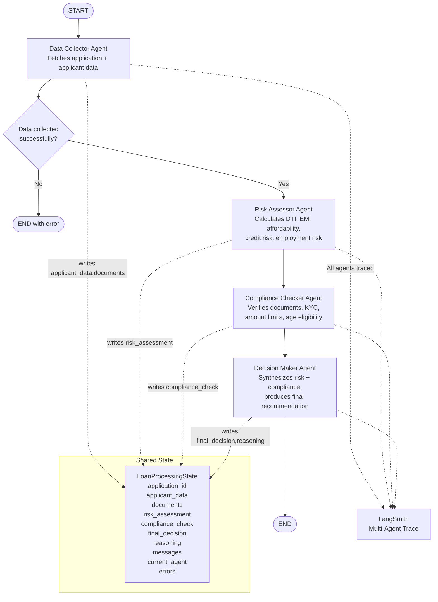

# Phase 5: Multi-Agent System with LangGraph
## POC-01 — Loan Application Management System

**Phase Weight:** 20% | **Duration:** 5 days | **Test Cases:** 25

---

## 1. Phase Overview

### Objectives
Phase 5 builds a **LangGraph multi-agent system** that automates the loan underwriting process. Four specialized agents work in a coordinated pipeline — each with deep expertise in one domain — to evaluate any loan application and produce a comprehensive, auditable underwriting recommendation.

By the end of Phase 5, you will have:
- A LangGraph `StateGraph` with Supervisor routing pattern
- 4 specialized agent nodes: Data Collector, Risk Assessor, Compliance Checker, Decision Maker
- A shared `TypedDict` state that flows through the entire graph
- Conditional edges that handle error paths gracefully
- Full LangSmith multi-agent tracing showing every agent's contribution

### Why Multi-Agent?

A single LLM agent evaluating a loan application would have conflicting responsibilities: collecting data, calculating risk, verifying compliance, AND making decisions. This leads to:
- Context overload (too much information for one agent)
- Mixed-quality prompts (no prompt can be expert in everything)
- No auditability (can't see which reasoning step failed)

With 4 specialized agents:
- Each agent has a **focused system prompt** tuned for its domain
- Each agent's **output is visible and auditable** in LangSmith
- **Failures are isolated** — if compliance fails, data collection is still visible
- The system is **extensible** — add a fraud detection agent later without rewriting everything

This is the real-world pattern used in production banking AI systems.

### 5-Day Schedule

| Day | Focus | Activities |
|-----|-------|-----------|
| Day 1 | LangGraph Concepts | Study LangGraph StateGraph, TypedDict state, nodes, edges, Supervisor pattern |
| Day 2 | State + Data Collector | Define state schema, implement Data Collector agent |
| Day 3 | Risk + Compliance Agents | Implement Risk Assessor and Compliance Checker agents |
| Day 4 | Decision Maker + Graph | Implement Decision Maker, build full graph with edges and routing |
| Day 5 | Testing + Observability | Run all 25 test cases, verify LangSmith traces, fix failures |

---

## 2. Prerequisites

- [ ] Phase 1 backend running on `http://localhost:8000`
- [ ] Phase 4 MCP tools working (agents will use them to fetch data)
- [ ] `langgraph` installed: `pip install langgraph==0.1.17`
- [ ] `LANGCHAIN_PROJECT` updated to `AI-Readiness-POC-01-P5`

---

## 3. Concepts to Self-Learn

| Concept | Search Term | Estimated Time |
|---------|-------------|----------------|
| LangGraph introduction | "LangGraph tutorial introduction 2024" | 45 min |
| StateGraph and TypedDict | "LangGraph StateGraph TypedDict state" | 30 min |
| Agent nodes in LangGraph | "LangGraph agent node function" | 30 min |
| Supervisor pattern | "LangGraph supervisor multi-agent pattern" | 45 min |
| Conditional edges | "LangGraph conditional edges END" | 20 min |
| LangSmith multi-agent tracing | "LangSmith trace multi-agent LangGraph" | 20 min |

---

## 4. Project Structure Addition

```
poc-01-loan-app/
└── multi_agent/                   ← New folder for Phase 5
    ├── state.py                   ← TypedDict state schema
    ├── agents/
    │   ├── data_collector.py      ← Agent 1
    │   ├── risk_assessor.py       ← Agent 2
    │   ├── compliance_checker.py  ← Agent 3
    │   └── decision_maker.py      ← Agent 4
    ├── graph.py                   ← LangGraph StateGraph builder
    └── main.py                    ← Entry point + Streamlit UI
```

---

## 5. User Stories

### US-01-P5-01: Shared State Schema
**Priority:** Must Have | **Story Points:** 2

> As a developer, I want a shared TypedDict state schema that all agents can read from and write to, so that information flows through the pipeline without data loss.

**Acceptance Criteria:**
- **Given** the state schema, **When** initialized with `application_id`, **Then** all other fields default to empty/None
- **Given** the Data Collector updates `applicant_data`, **When** the Risk Assessor reads the state, **Then** `applicant_data` contains the data written by the collector
- **Given** any field in state, **When** accessed by an agent, **Then** no KeyError is raised (all fields have defaults)

---

### US-01-P5-02: Data Collector Agent
**Priority:** Must Have | **Story Points:** 3

> As a Data Collector agent, I want to fetch all relevant application data from the MCP/REST API, so that downstream agents have complete information without making their own API calls.

**Acceptance Criteria:**
- **Given** application_id in state, **When** the Data Collector runs, **Then** `applicant_data` and `documents` fields in state are populated with API data
- **Given** the application does not exist, **When** the Data Collector runs, **Then** an error is added to `errors` and the graph terminates gracefully
- **Given** successful data collection, **When** state is inspected, **Then** `current_agent` is set to "data_collector" and applicant_data contains credit_score, annual_income, employment_status

---

### US-01-P5-03: Risk Assessor Agent
**Priority:** Must Have | **Story Points:** 3

> As a Risk Assessor agent, I want to evaluate the financial risk of a loan application based on the collected data, so that the Decision Maker has a quantified risk profile.

**Acceptance Criteria:**
- **Given** applicant_data in state, **When** the Risk Assessor runs, **Then** `risk_assessment` is populated with: debt_to_income_ratio, emi_affordability (yes/no), credit_risk_level (low/medium/high), employment_risk (low/medium/high), and overall_risk_score (0-100)
- **Given** a credit score < 650, **When** risk is assessed, **Then** `credit_risk_level` = "high"
- **Given** EMI > 50% of monthly income, **When** assessed, **Then** `emi_affordability` = "no"

---

### US-01-P5-04: Compliance Checker Agent
**Priority:** Must Have | **Story Points:** 3

> As a Compliance Checker agent, I want to verify that all regulatory and documentation requirements are met, so that the bank avoids compliance violations.

**Acceptance Criteria:**
- **Given** documents in state, **When** the Compliance Checker runs, **Then** `compliance_check` is populated with: documents_complete (bool), missing_documents (list), kyc_verified (bool), amount_within_limit (bool), age_eligible (bool), compliance_passed (bool)
- **Given** a home loan without property_docs, **When** checked, **Then** `missing_documents` contains "property_docs" and `documents_complete` = False
- **Given** all required documents present, **When** checked, **Then** `compliance_passed` = True

---

### US-01-P5-05: Decision Maker Agent and Final Output
**Priority:** Must Have | **Story Points:** 5

> As a Decision Maker agent, I want to synthesize risk and compliance findings to produce a final underwriting recommendation, so that loan officers receive an actionable, reasoned decision.

**Acceptance Criteria:**
- **Given** risk_assessment and compliance_check in state, **When** the Decision Maker runs, **Then** `final_decision` is one of: "APPROVE", "REJECT", "REQUEST_MORE_INFO"
- **Given** compliance_passed=False, **When** decision is made, **Then** `final_decision` = "REQUEST_MORE_INFO" or "REJECT" (never APPROVE with missing compliance)
- **Given** overall_risk_score > 70 and compliance_passed, **When** decision is made, **Then** `final_decision` = "APPROVE" with supporting reasoning in `reasoning` field

---

## 6. Architecture Diagram



---

## 7. Step-by-Step Implementation Guide

### Step 7.1: State Schema

```python
# multi_agent/state.py
from typing import TypedDict, Optional, List

class RiskAssessment(TypedDict):
    debt_to_income_ratio: float
    emi_amount: float
    emi_affordability: str      # "yes" or "no"
    credit_risk_level: str      # "low", "medium", "high"
    employment_risk: str        # "low", "medium", "high"
    overall_risk_score: float   # 0-100 (higher = better candidate)
    risk_summary: str

class ComplianceCheck(TypedDict):
    documents_complete: bool
    missing_documents: List[str]
    kyc_verified: bool
    amount_within_limit: bool
    age_eligible: bool
    compliance_passed: bool
    compliance_notes: str

class LoanProcessingState(TypedDict):
    application_id: str
    applicant_data: dict           # From API: applicant profile
    application_data: dict         # From API: loan application details
    documents: List[dict]          # From API: uploaded documents
    risk_assessment: RiskAssessment
    compliance_check: ComplianceCheck
    final_decision: str            # "APPROVE", "REJECT", "REQUEST_MORE_INFO"
    reasoning: str                 # Full decision reasoning
    messages: List[dict]           # Agent messages for tracing
    current_agent: str             # Which agent is currently active
    errors: List[str]              # Any errors encountered
```

### Step 7.2: Data Collector Agent

```python
# multi_agent/agents/data_collector.py
import os
import time
import requests
import structlog
from opentelemetry import trace
from multi_agent.state import LoanProcessingState

logger = structlog.get_logger()
tracer = trace.get_tracer("data-collector")

API_BASE = os.getenv("API_BASE_URL", "http://localhost:8000/api/v1")

def data_collector(state: LoanProcessingState) -> LoanProcessingState:
    """Fetch all application data needed for underwriting evaluation."""
    log = logger.bind(poc_id="POC-01", phase=5, agent="data_collector",
                      application_id=state["application_id"])
    start = time.time()
    
    with tracer.start_as_current_span("agent.data_collector.activate") as span:
        span.set_attribute("agent.name", "data_collector")
        span.set_attribute("agent.application_id", state["application_id"])
        
        headers = {"Authorization": f"Bearer {os.getenv('API_JWT_TOKEN', '')}"}
        app_id = state["application_id"]
        
        # Fetch application details
        try:
            resp = requests.get(f"{API_BASE}/applications/{app_id}", headers=headers, timeout=10)
            if resp.status_code == 404:
                log.error("application_not_found", application_id=app_id)
                return {
                    **state,
                    "errors": [f"Application {app_id} not found"],
                    "current_agent": "data_collector"
                }
            app_data = resp.json()
        except Exception as e:
            return {**state, "errors": [f"Failed to fetch application: {str(e)}"],
                    "current_agent": "data_collector"}
        
        # Fetch applicant details
        applicant_id = app_data.get("applicant_id")
        try:
            resp = requests.get(f"{API_BASE}/applicants/{applicant_id}", headers=headers, timeout=10)
            applicant_data = resp.json()
        except Exception as e:
            applicant_data = {}
            log.warning("applicant_fetch_failed", applicant_id=applicant_id, error=str(e))
        
        # Documents are in the application response
        documents = app_data.get("documents", [])
        
        duration_ms = int((time.time() - start) * 1000)
        span.set_attribute("agent.output_keys_populated", "applicant_data,application_data,documents")
        span.set_attribute("agent.duration_ms", duration_ms)
        
        log.info("data_collection_complete",
                 application_id=app_id,
                 documents_count=len(documents),
                 duration_ms=duration_ms,
                 status="success")
        
        return {
            **state,
            "application_data": app_data,
            "applicant_data": applicant_data,
            "documents": documents,
            "current_agent": "data_collector",
            "messages": state.get("messages", []) + [{
                "agent": "data_collector",
                "message": f"Collected data for application {app_id}: "
                           f"{len(documents)} documents, applicant credit score: "
                           f"{applicant_data.get('credit_score', 'unknown')}"
            }]
        }
```

### Step 7.3: Risk Assessor Agent

```python
# multi_agent/agents/risk_assessor.py
import os
import time
import structlog
from langchain_google_genai import ChatGoogleGenerativeAI
from langchain.prompts import ChatPromptTemplate
from opentelemetry import trace
from multi_agent.state import LoanProcessingState

logger = structlog.get_logger()
tracer = trace.get_tracer("risk-assessor")

RISK_SYSTEM_PROMPT = """You are a senior risk analyst at a bank. Evaluate the loan application risk.

Given this applicant data: {applicant_data}
Loan application: {application_data}

Calculate and provide:
1. debt_to_income_ratio (total monthly obligations / gross monthly income). Assume existing obligations = 10% of income unless specified.
2. emi_amount using formula: P × r × (1+r)^n / ((1+r)^n - 1) where r = 12%/12/100 (assume 12% interest)
3. emi_affordability: "yes" if EMI < 50% of monthly income, else "no"
4. credit_risk_level: "low" (CIBIL 750+), "medium" (650-749), "high" (<650 or no score)
5. employment_risk: "low" (salaried 2+ years), "medium" (salaried <2 years or self-employed), "high" (unemployed)
6. overall_risk_score: 0-100 where 100 is ideal. Deduct: 30 for high credit risk, 20 for emi not affordable, 15 for high employment risk, 10 each for medium risk
7. risk_summary: 2-3 sentence summary

Respond ONLY as JSON matching this exact structure:
{{"debt_to_income_ratio": 0.0, "emi_amount": 0.0, "emi_affordability": "yes/no", 
  "credit_risk_level": "low/medium/high", "employment_risk": "low/medium/high",
  "overall_risk_score": 0.0, "risk_summary": "..."}}"""

def risk_assessor(state: LoanProcessingState) -> LoanProcessingState:
    """Evaluate financial risk of the loan application."""
    log = logger.bind(poc_id="POC-01", phase=5, agent="risk_assessor")
    start = time.time()
    
    with tracer.start_as_current_span("agent.risk_assessor.activate") as span:
        span.set_attribute("agent.name", "risk_assessor")
        
        llm = ChatGoogleGenerativeAI(
            model="gemini-2.0-flash",
            google_api_key=os.getenv("GOOGLE_API_KEY"),
            temperature=0
        )
        
        prompt = ChatPromptTemplate.from_template(RISK_SYSTEM_PROMPT)
        chain = prompt | llm
        
        response = chain.invoke({
            "applicant_data": str(state.get("applicant_data", {})),
            "application_data": str(state.get("application_data", {}))
        })
        
        import json, re
        # Extract JSON from response
        json_match = re.search(r'\{.*\}', response.content, re.DOTALL)
        if json_match:
            risk_data = json.loads(json_match.group())
        else:
            risk_data = {
                "debt_to_income_ratio": 0.35, "emi_amount": 0.0,
                "emi_affordability": "unknown", "credit_risk_level": "medium",
                "employment_risk": "medium", "overall_risk_score": 50.0,
                "risk_summary": "Risk assessment could not be fully parsed."
            }
        
        duration_ms = int((time.time() - start) * 1000)
        span.set_attribute("agent.risk_score", risk_data.get("overall_risk_score", 0))
        span.set_attribute("agent.duration_ms", duration_ms)
        
        log.info("risk_assessment_complete",
                 risk_score=risk_data.get("overall_risk_score"),
                 credit_risk=risk_data.get("credit_risk_level"),
                 duration_ms=duration_ms)
        
        return {
            **state,
            "risk_assessment": risk_data,
            "current_agent": "risk_assessor",
            "messages": state.get("messages", []) + [{
                "agent": "risk_assessor",
                "message": f"Risk score: {risk_data.get('overall_risk_score')}/100. "
                           f"Credit risk: {risk_data.get('credit_risk_level')}. "
                           f"EMI affordable: {risk_data.get('emi_affordability')}."
            }]
        }
```

### Step 7.4: Compliance Checker Agent

```python
# multi_agent/agents/compliance_checker.py
import os
import time
import structlog
from opentelemetry import trace
from multi_agent.state import LoanProcessingState

logger = structlog.get_logger()
tracer = trace.get_tracer("compliance-checker")

REQUIRED_DOCS = {
    "personal": ["id_proof", "income_proof", "bank_statement"],
    "home": ["id_proof", "income_proof", "bank_statement", "property_docs", "employment_letter"],
    "auto": ["id_proof", "income_proof", "bank_statement"]
}

LOAN_LIMITS = {"personal": 2500000, "home": 50000000, "auto": 5000000}

def compliance_checker(state: LoanProcessingState) -> LoanProcessingState:
    """Verify regulatory and documentation compliance."""
    log = logger.bind(poc_id="POC-01", phase=5, agent="compliance_checker")
    start = time.time()
    
    with tracer.start_as_current_span("agent.compliance_checker.activate") as span:
        span.set_attribute("agent.name", "compliance_checker")
        
        app = state.get("application_data", {})
        applicant = state.get("applicant_data", {})
        documents = state.get("documents", [])
        
        loan_type = app.get("loan_type", "personal")
        amount = app.get("amount_requested", 0)
        
        # Document check
        uploaded_doc_types = {doc.get("doc_type") for doc in documents if doc.get("doc_type")}
        required = set(REQUIRED_DOCS.get(loan_type, []))
        missing = list(required - uploaded_doc_types)
        docs_complete = len(missing) == 0
        
        # KYC: id_proof uploaded and verified
        id_docs = [d for d in documents if d.get("doc_type") == "id_proof"]
        kyc_verified = len(id_docs) > 0 and any(d.get("verified", False) for d in id_docs)
        
        # Amount within limit
        limit = LOAN_LIMITS.get(loan_type, 2500000)
        amount_within_limit = amount <= limit
        
        # Age check (simplified — assume applicant has age if credit_score is present)
        age_eligible = applicant.get("credit_score") is not None or True  # Simplified
        
        compliance_passed = docs_complete and amount_within_limit and age_eligible
        
        notes = []
        if missing:
            notes.append(f"Missing documents: {', '.join(missing)}")
        if not amount_within_limit:
            notes.append(f"Amount ₹{amount:,.0f} exceeds {loan_type} loan limit of ₹{limit:,.0f}")
        if not kyc_verified:
            notes.append("KYC documents not yet verified")
        
        compliance_data = {
            "documents_complete": docs_complete,
            "missing_documents": missing,
            "kyc_verified": kyc_verified,
            "amount_within_limit": amount_within_limit,
            "age_eligible": age_eligible,
            "compliance_passed": compliance_passed,
            "compliance_notes": "; ".join(notes) if notes else "All compliance checks passed"
        }
        
        duration_ms = int((time.time() - start) * 1000)
        span.set_attribute("agent.compliance_passed", compliance_passed)
        span.set_attribute("agent.missing_docs", len(missing))
        
        log.info("compliance_check_complete",
                 compliance_passed=compliance_passed,
                 missing_docs=len(missing),
                 duration_ms=duration_ms)
        
        return {
            **state,
            "compliance_check": compliance_data,
            "current_agent": "compliance_checker",
            "messages": state.get("messages", []) + [{
                "agent": "compliance_checker",
                "message": f"Compliance: {'PASSED' if compliance_passed else 'FAILED'}. "
                           f"{compliance_data['compliance_notes']}"
            }]
        }
```

### Step 7.5: Decision Maker Agent

```python
# multi_agent/agents/decision_maker.py
import os
import time
import structlog
from langchain_google_genai import ChatGoogleGenerativeAI
from langchain.prompts import ChatPromptTemplate
from opentelemetry import trace
from multi_agent.state import LoanProcessingState

logger = structlog.get_logger()
tracer = trace.get_tracer("decision-maker")

DECISION_PROMPT = """You are the final underwriting decision maker at a bank. 
Based on the risk assessment and compliance check below, make a final lending decision.

Risk Assessment: {risk_assessment}
Compliance Check: {compliance_check}
Application Details: {application_data}

Decision Rules:
- APPROVE if: compliance_passed=True AND overall_risk_score >= 60 AND emi_affordability="yes"
- REJECT if: compliance_passed=False and issues are unfixable (e.g., loan amount over limit, ineligible age) OR overall_risk_score < 40
- REQUEST_MORE_INFO if: documents missing but fixable, OR borderline risk (40-59 score)

Provide a professional underwriting decision with detailed reasoning.
Format your response as:
DECISION: [APPROVE/REJECT/REQUEST_MORE_INFO]
REASONING: [Detailed reasoning explaining the decision, referencing specific data points]
RECOMMENDATIONS: [If REQUEST_MORE_INFO: specific items needed; if REJECT: what could improve future applications; if APPROVE: any conditions]"""

def decision_maker(state: LoanProcessingState) -> LoanProcessingState:
    """Synthesize risk and compliance to produce final underwriting decision."""
    log = logger.bind(poc_id="POC-01", phase=5, agent="decision_maker")
    start = time.time()
    
    with tracer.start_as_current_span("agent.decision_maker.activate") as span:
        span.set_attribute("agent.name", "decision_maker")
        
        llm = ChatGoogleGenerativeAI(
            model="gemini-2.0-flash",
            google_api_key=os.getenv("GOOGLE_API_KEY"),
            temperature=0.1
        )
        
        prompt = ChatPromptTemplate.from_template(DECISION_PROMPT)
        chain = prompt | llm
        
        response = chain.invoke({
            "risk_assessment": str(state.get("risk_assessment", {})),
            "compliance_check": str(state.get("compliance_check", {})),
            "application_data": str(state.get("application_data", {}))
        })
        
        content = response.content
        
        # Parse decision
        decision = "REQUEST_MORE_INFO"
        for d in ["APPROVE", "REJECT", "REQUEST_MORE_INFO"]:
            if f"DECISION: {d}" in content:
                decision = d
                break
        
        # Extract reasoning (everything after REASONING:)
        reasoning = content
        if "REASONING:" in content:
            reasoning = content.split("REASONING:", 1)[1].strip()
        
        duration_ms = int((time.time() - start) * 1000)
        span.set_attribute("agent.final_decision", decision)
        span.set_attribute("agent.duration_ms", duration_ms)
        
        log.info("decision_made",
                 decision=decision,
                 application_id=state.get("application_id"),
                 duration_ms=duration_ms)
        
        return {
            **state,
            "final_decision": decision,
            "reasoning": reasoning,
            "current_agent": "decision_maker",
            "messages": state.get("messages", []) + [{
                "agent": "decision_maker",
                "message": f"Final Decision: {decision}"
            }]
        }
```

### Step 7.6: Graph Builder

```python
# multi_agent/graph.py
import structlog
from opentelemetry import trace
from langgraph.graph import StateGraph, END
from multi_agent.state import LoanProcessingState
from multi_agent.agents.data_collector import data_collector
from multi_agent.agents.risk_assessor import risk_assessor
from multi_agent.agents.compliance_checker import compliance_checker
from multi_agent.agents.decision_maker import decision_maker

logger = structlog.get_logger()
tracer = trace.get_tracer("loan-graph")

def should_continue_after_data_collection(state: LoanProcessingState) -> str:
    """Conditional edge: if data collection failed, go to END."""
    if state.get("errors"):
        logger.bind(poc_id="POC-01", phase=5).warning(
            "supervisor_routing", from_agent="data_collector", to_agent="END",
            reason=f"errors: {state['errors']}"
        )
        return "end"
    logger.bind(poc_id="POC-01", phase=5).info(
        "supervisor_routing", from_agent="data_collector", to_agent="risk_assessor"
    )
    return "continue"

def build_loan_evaluation_graph():
    """Build and compile the multi-agent loan evaluation graph."""
    workflow = StateGraph(LoanProcessingState)
    
    # Add agent nodes
    workflow.add_node("data_collector", data_collector)
    workflow.add_node("risk_assessor", risk_assessor)
    workflow.add_node("compliance_checker", compliance_checker)
    workflow.add_node("decision_maker", decision_maker)
    
    # Entry point
    workflow.set_entry_point("data_collector")
    
    # Conditional edge after data collection
    workflow.add_conditional_edges(
        "data_collector",
        should_continue_after_data_collection,
        {
            "continue": "risk_assessor",
            "end": END
        }
    )
    
    # Linear edges for the rest of the pipeline
    workflow.add_edge("risk_assessor", "compliance_checker")
    workflow.add_edge("compliance_checker", "decision_maker")
    workflow.add_edge("decision_maker", END)
    
    return workflow.compile()

def evaluate_loan_application(application_id: str) -> LoanProcessingState:
    """Run the full multi-agent evaluation for a loan application."""
    log = logger.bind(poc_id="POC-01", phase=5, application_id=application_id)
    
    with tracer.start_as_current_span("graph.execute") as span:
        span.set_attribute("graph.application_id", application_id)
        span.set_attribute("graph.input_node", "START")
        
        graph = build_loan_evaluation_graph()
        
        initial_state: LoanProcessingState = {
            "application_id": application_id,
            "applicant_data": {},
            "application_data": {},
            "documents": [],
            "risk_assessment": {},
            "compliance_check": {},
            "final_decision": "",
            "reasoning": "",
            "messages": [],
            "current_agent": "",
            "errors": []
        }
        
        log.info("graph_execution_started")
        
        final_state = graph.invoke(
            initial_state,
            config={
                "metadata": {
                    "poc_id": "POC-01",
                    "phase": 5,
                    "application_id": application_id
                }
            }
        )
        
        span.set_attribute("graph.final_decision", final_state.get("final_decision", "unknown"))
        span.set_attribute("graph.agents_executed", len(final_state.get("messages", [])))
        
        log.info("graph_execution_complete",
                 final_decision=final_state.get("final_decision"),
                 agents_executed=len(final_state.get("messages", [])),
                 errors=final_state.get("errors", []))
        
        return final_state
```

### Step 7.7: Running Phase 5

```python
# multi_agent/main.py
from dotenv import load_dotenv
load_dotenv()

from multi_agent.graph import evaluate_loan_application

if __name__ == "__main__":
    application_id = input("Enter application ID to evaluate: ").strip()
    
    print(f"\n{'='*60}")
    print(f"Evaluating Loan Application #{application_id}")
    print('='*60)
    
    result = evaluate_loan_application(application_id)
    
    print("\n📊 AGENT MESSAGES:")
    for msg in result.get("messages", []):
        print(f"  [{msg['agent'].upper()}]: {msg['message']}")
    
    print(f"\n{'='*60}")
    print(f"FINAL DECISION: {result.get('final_decision', 'NOT REACHED')}")
    print(f"\nREASONING:\n{result.get('reasoning', 'N/A')[:500]}...")
    
    if result.get("errors"):
        print(f"\n⚠️  ERRORS: {result['errors']}")
```

```bash
# Start Phase 1 API
cd backend && uvicorn app.main:app --reload --port 8000

# Run the multi-agent evaluation
cd multi_agent
python main.py
# Enter application ID: 1
```

---

## 8. Logging & Observability Requirements

| Event | Required Log Fields | OTel Span |
|-------|-------------------|-----------|
| Graph execution started | application_id, poc_id, phase=5 | `graph.execute` |
| Agent activated | agent_name, application_id | `agent.{name}.activate` |
| Supervisor routing | from_agent, to_agent, reason | `supervisor.route` |
| Graph complete | final_decision, agents_executed | End of `graph.execute` span |

**LangSmith:** Graph execution must create a multi-level trace tree showing each agent as a sub-trace under the main graph trace. Set `LANGCHAIN_PROJECT=AI-Readiness-POC-01-P5`.

---

## 9. Test Case Specifications Summary

| # | Test ID | Category | Count |
|---|---------|----------|-------|
| 1-4 | TC-01-P5-STATE-01 to 04 | State Schema | 4 |
| 5-12 | TC-01-P5-AGENT-01 to 08 | Individual Agents | 8 |
| 13-18 | TC-01-P5-ROUTE-01 to 06 | Supervisor Routing | 6 |
| 19-25 | TC-01-P5-E2E-01 to 07 | End-to-End | 7 |

See `tests/phase5-test-spec.md` for full details.

---

## 10. Submission Checklist

- [ ] `LoanProcessingState` TypedDict defined with all fields and defaults
- [ ] All 4 agent node functions implemented and tested independently
- [ ] `build_loan_evaluation_graph()` compiles without errors
- [ ] `evaluate_loan_application("1")` runs to completion with final_decision populated
- [ ] High risk application (credit_score < 600) results in REJECT or REQUEST_MORE_INFO
- [ ] Application with missing home loan docs results in REQUEST_MORE_INFO
- [ ] Application with good credit and all docs results in APPROVE
- [ ] LangSmith project `AI-Readiness-POC-01-P5` shows multi-level trace tree
- [ ] `agent.{name}.activate` OTel spans appear for each agent
- [ ] `graph.execute` OTel span wraps the full graph execution
- [ ] `supervisor_routing` log events appear with from/to agent names
- [ ] At least 18 of 25 test cases pass

---

## 11. Common Mistakes & Tips

| Mistake | Fix |
|---------|-----|
| `TypedDict` fields without defaults cause KeyError | Initialize all fields in `initial_state` dict |
| Agent returns full state but forgets `**state` spread | Always do `return {**state, "new_field": value}` |
| LangGraph compilation error: node not connected | Every node must have at least one incoming and outgoing edge |
| Circular edge causes infinite loop | Loan evaluation is linear — no cycles needed |
| JSON parsing fails in Risk Assessor | Use regex to extract JSON, have fallback values |
| LangSmith doesn't show sub-traces per agent | Wrap each agent in `@traceable` decorator from langsmith |
| Decision maker sees empty risk_assessment | Previous agent returned state without the field — check agent output |
